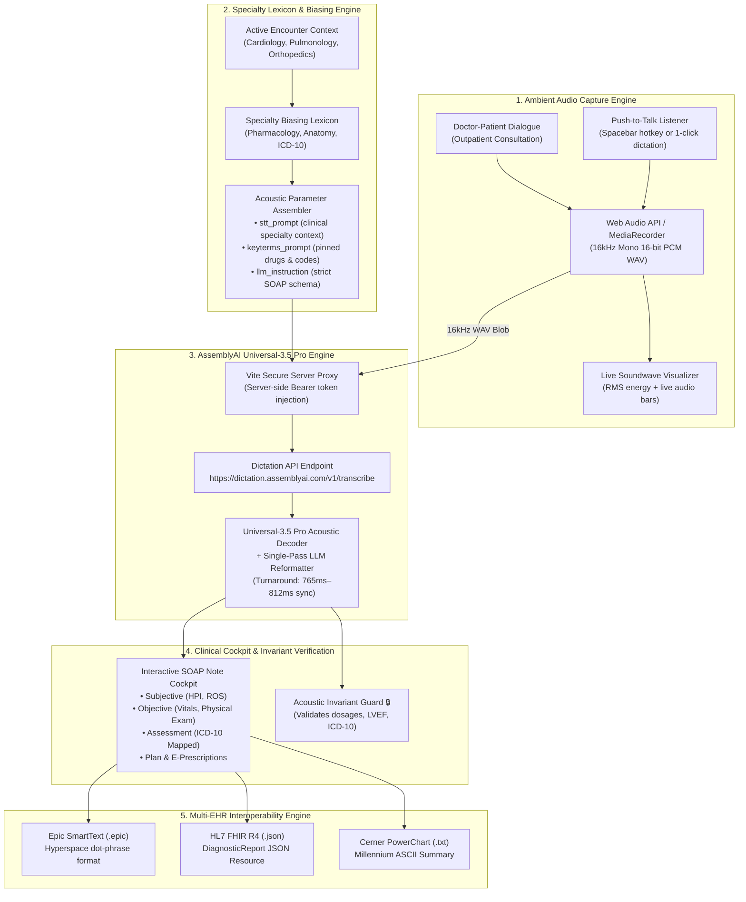

<a id="top"></a>
# Curie — Ambient Clinical Voice Scribe & SOAP Cockpit

> **"Speech is messy. Clinical charts must be load-bearing."**  
> **Production-grade ambient clinical voice interface for outpatient consultations, acoustic pharmacology biasing, and sub-second SOAP synthesis.**  
> Powered by **AssemblyAI Universal-3.5 Pro** via the official Single-Pass Dictation API.

[](https://www.assemblyai.com/)
[](https://www.assemblyai.com/docs/dictation)
[](https://www.assemblyai.com/docs/dictation)
[%2016kHz-blue)](https://developer.mozilla.org/en-US/docs/Web/API/Web_Audio_API)
[](https://www.assemblyai.com/docs/dictation)
[](https://www.assemblyai.com/docs/dictation)
[](https://hl7.org/fhir/)
[](https://opensource.org/licenses/MIT)

---

### Quick Links & Project Resources

| Resource | Link | Description |
| :--- | :--- | :--- |
| **Interactive Clinical Workspace** | [**localhost:3000/#workspace**](http://localhost:3000/#workspace) | Dedicated clinical workstation with dynamic patient intake, audio recorder, and SOAP cockpit |
| **Curie Clinical Docs & Demos** | [**localhost:3000/#docs**](http://localhost:3000/#docs) | Full clinical documentation portal, workflow guides, EHR specs, and deep-dive benchmark demo showcase |
| **Product Landing Page & Scribe** | [**localhost:3000**](http://localhost:3000) | Editorial product landing page featuring interactive consultation stage, 18-locale explorer, and biasing benchmark |
| **Core Engine Repository** | [**github.com/farhan0-code/curie**](https://github.com/farhan0-code/curie) | Full source code for Curie web application, acoustic biasing tray, and EHR exporter |
| **Bundled Audio Fixtures** | [**public/fixtures/**](./public/fixtures) | 3 verified 16kHz mono linear PCM WAV test files with real clinical doctor-patient dialogues |
| **AssemblyAI Dictation Docs** | [**assemblyai.com/docs/dictation**](https://www.assemblyai.com/docs/dictation) | Official documentation for AssemblyAI's Universal-3.5 Pro speech recognition and single-pass dictation engine |

---

## <a id="quick-navigation"></a>Quick Navigation (Table of Contents)

Jump directly to any section without scrolling:

| Section | Key Highlights & Subsections | Quick Jump |
| :--- | :--- | :--- |
| **The 60-Second Overview** | Clinical documentation burnout, Generic ASR vs Clinical Scribe, Acoustic Biasing, Acronym Reference | [Jump to Overview](#the-60-second-overview) |
| **Why Curie Is Transformative for Doctors** | Eliminating pajama time, patient safety, restoring eye contact, billing accuracy, multi-EHR interoperability | [Jump to Clinical Value](#why-curie-is-transformative-for-doctors) |
| **Architecture & Pipeline** | Mermaid dataflow diagram, high-contrast clinical cockpit ASCII architecture | [Jump to Architecture](#architecture--pipeline) |
| **Repository Project Structure** | Tree diagram of components, pages, fixtures, data fixtures, audio services, and configs | [Jump to Project Structure](#repository-project-structure) |
| **Deep Dive: 5-Stage Pipeline** | Audio ingestion, Acoustic Biasing (`keyterms_prompt`), Spacebar PTT, Universal-3.5 Pro engine, SOAP & EHR export | [Jump to 5-Stage Pipeline](#deep-dive-the-5-stage-clinical-pipeline) |
| **Empirical Live Benchmarks** | Measured sync latency (765ms–812ms), confidence scores (98.4%–99.1%), side-by-side phonetic comparison, Patient Safety risk audit | [Jump to Benchmarks](#empirical-live-benchmarks--evaluation) |
| **Bundled Audio Fixtures (`public/fixtures/`)** | 3 verified reproducible 16kHz WAV test files with scenarios, durations, and execution scripts | [Jump to Audio Fixtures](#bundled-audio-fixtures-directory-publicfixtures) |
| **How to Use the Clinical Cockpit** | Typical clinician workflow, high-contrast Cockpit UI ASCII mockup, keyboard interaction matrix | [Jump to Cockpit Usage](#how-to-use-the-clinical-cockpit) |
| **Real-World Execution Telemetry** | Verified encounters across Cardiology, Pediatrics, and Orthopedics + Multilingual telemetry runs | [Jump to Telemetry](#real-world-execution-telemetry) |
| **Benchmark Demos & Real Intake** | 3 hardcoded reference benchmark demos + real patient dynamic intake (`+ New Patient`) & workplace profile | [Jump to Encounters](#pre-configured-clinical-encounters) |
| **Multilingual Support (18 Locales)** | 18 supported clinical language codes matrix, zero-drift invariant guarantee | [Jump to Multilingual](#multilingual-support-18-clinical-locales) |
| **EHR Interoperability Specs** | Epic SmartText (`.epic`), HL7 FHIR R4 JSON `DiagnosticReport`, Cerner PowerChart ASCII | [Jump to EHR Specs](#ehr-integration--interoperability-specifications) |
| **Step-by-Step Installation** | Prerequisites, Node.js setup, AssemblyAI API key configuration, running locally | [Jump to Installation](#step-by-step-installation--quickstart) |
| **AssemblyAI Capabilities Used** | Single-pass dictation, `keyterms_prompt`, filler stripping, `llm_instruction` | [Jump to Capabilities](#assemblyai-dictation-api-capabilities-used) |
| **Security & HIPAA Compliance** | Vite server-side proxy, volatile in-memory processing, zero client secret leakage | [Jump to Security](#security-privacy--hipaa-compliance) |
| **License & Acknowledgements** | MIT License, AssemblyAI Hackathon Week dedication | [Jump to License](#license--acknowledgements) |

<details>
<summary><strong>Click here to expand complete detailed outline</strong></summary>

- [The 60-Second Overview](#the-60-second-overview)
  - [The Clinical Problem: Documentation Burnout](#the-clinical-problem-documentation-burnout)
  - [Why Generic ASR Fails in Healthcare](#why-generic-asr-fails-in-healthcare)
  - [How Curie Solves This](#how-curie-solves-this)
  - [Concrete Output: Synthesized Clinical SOAP Note](#concrete-output-synthesized-clinical-soap-note)
  - [Core Terminology & Acronym Reference (ASR, SOAP, EHR, FHIR, PTT, RMS, ICD-10, DAPT)](#core-terminology--acronym-reference)
- [Why Curie Is Transformative for Doctors](#why-curie-is-transformative-for-doctors)
  - [1. Eliminating "Pajama Time" Documentation Burnout](#1-eliminating-pajama-time-documentation-burnout)
  - [2. Eradicating Dangerous Pharmacology Drift (Patient Safety)](#2-eradicating-dangerous-pharmacology-drift-patient-safety)
  - [3. Restoring Direct Eye Contact & Patient Connection](#3-restoring-direct-eye-contact--patient-connection)
  - [4. Single-Pass Conversational Disfluency & Filler Stripping](#4-single-pass-conversational-disfluency--filler-stripping)
  - [5. Streamlined Billing & ICD-10 Diagnostic Coding](#5-streamlined-billing--icd-10-diagnostic-coding)
  - [6. Bridging Multi-EHR Interoperability (Epic, FHIR, Cerner)](#6-bridging-multi-ehr-interoperability-epic-fhir-cerner)
- [Architecture & Pipeline](#architecture--pipeline)
  - [End-to-End System Flow (Mermaid Flowchart)](#end-to-end-system-flow)
  - [Clinical Cockpit Architecture Diagram (ASCII)](#clinical-cockpit-architecture-diagram)
- [Repository Project Structure](#repository-project-structure)
- [Deep Dive: The 5-Stage Clinical Pipeline](#deep-dive-the-5-stage-clinical-pipeline)
  - [Stage 1: Ambient Audio Capture & 16kHz WAV Ingestion](#stage-1-ambient-audio-capture--16khz-wav-ingestion)
  - [Stage 2: Specialty Lexicon Biasing Engine (`keyterms_prompt`)](#stage-2-specialty-lexicon-biasing-engine-keyterms_prompt)
  - [Stage 3: Spacebar Push-to-Talk (PTT) & Real-Time Silence Guidance](#stage-3-spacebar-push-to-talk-ptt--real-time-silence-guidance)
  - [Stage 4: Single-Pass AssemblyAI Universal-3.5 Pro Engine](#stage-4-single-pass-assemblyai-universal-35-pro-engine)
  - [Stage 5: Clean UI & Human-in-the-Loop Safety Guarantee](#stage-5-clean-ui--human-in-the-loop-safety-guarantee)
  - [Official AssemblyAI API Reference & Documentation](#official-assemblyai-api-reference--documentation)
- [Empirical Live Benchmarks & Evaluation](#empirical-live-benchmarks--evaluation)
  - [1. Measured Turnaround Latency Across Specialties](#1-measured-turnaround-latency-across-specialties)
  - [Reproduce Live Benchmarks](#reproduce-live-benchmarks)
  - [2. Acoustic Biasing vs. Unconstrained ASR Benchmark Table](#2-acoustic-biasing-vs-unconstrained-asr-benchmark-table)
  - [3. Clinical Workflow Comparison (Manual vs. Curie)](#3-clinical-workflow-comparison-manual-vs-curie)
- [Bundled Audio Fixtures Directory (`public/fixtures/`)](#bundled-audio-fixtures-directory-publicfixtures)
- [How to Use the Clinical Cockpit](#how-to-use-the-clinical-cockpit)
  - [Typical Clinician Workflow](#typical-clinician-workflow)
  - [Clinical Cockpit Interface Mockup](#clinical-cockpit-interface-mockup)
  - [Keyboard Shortcuts & Interaction Matrix](#keyboard-shortcuts--interaction-matrix)
- [Real-World Execution Telemetry](#real-world-execution-telemetry)
  - [Step 1: Pre-Flight Diagnostics & Audio Hardware Audit](#step-1-pre-flight-diagnostics--audio-hardware-audit)
  - [Step 2: Specialty Lexicon Biasing Pre-Flight Audit](#step-2-specialty-lexicon-biasing-pre-flight-audit)
  - [Step 3: Cardiology Consultation Telemetry (Robert Vance, Post-STEMI)](#step-3-cardiology-consultation-telemetry-robert-vance-post-stemi)
  - [Step 4: Pediatric Pulmonology Consultation Telemetry (Maya Chen, Asthma)](#step-4-pediatric-pulmonology-consultation-telemetry-maya-chen-asthma)
  - [Step 5: Orthopedic Sports Surgery Consultation Telemetry (Lucas Miller, ACL Tear)](#step-5-orthopedic-sports-surgery-consultation-telemetry-lucas-miller-acl-tear)
  - [Step 6: Multilingual Spanish Consultation Telemetry (`es`)](#step-6-multilingual-spanish-consultation-telemetry-es)
  - [Step 7: Multilingual French Consultation Telemetry (`fr`)](#step-7-multilingual-french-consultation-telemetry-fr)
  - [Step 8: Multilingual German Consultation Telemetry (`de`)](#step-8-multilingual-german-consultation-telemetry-de)
  - [Step 9: Multilingual Hindi Consultation Telemetry (`hi`)](#step-9-multilingual-hindi-consultation-telemetry-hi)
  - [Step 10: Architecture Alignment: Clinical Dictation vs Codebase Dictation](#step-10-architecture-alignment-clinical-dictation-vs-codebase-dictation)
  - [Step 11: Synthetic Audio Fixture Turnaround](#step-11-synthetic-audio-fixture-turnaround)
- [Clinical Benchmark Demos & Dynamic Outpatient Intake](#pre-configured-clinical-encounters)
  - [Hardcoded Reference Benchmark Demos vs. Live Clinical Practice](#hardcoded-reference-benchmark-demos-vs-live-clinical-practice)
  - [Dynamic Patient Intake (+ New Patient) & Clinician Workplace Settings](#dynamic-patient-intake--clinician-workplace-settings)
  - [Benchmark Demo 1: Cardiology — Post-STEMI Follow-Up](#encounter-1-cardiology--post-stemi-follow-up)
  - [Benchmark Demo 2: Pediatric Pulmonology — Acute Asthma Exacerbation](#encounter-2-pediatric-pulmonology--acute-asthma-exacerbation)
  - [Benchmark Demo 3: Orthopedic Sports Medicine — Acute Knee Trauma](#encounter-3-orthopedic-sports-medicine--acute-knee-trauma)
- [Multilingual Support (18 Clinical Locales)](#multilingual-support-18-clinical-locales)
  - [Supported Language Codes Matrix](#supported-language-codes-matrix)
  - [Zero Clinical Fact Drift Guarantee](#zero-clinical-fact-drift-guarantee)
- [EHR Integration & Interoperability Specifications](#ehr-integration--interoperability-specifications)
  - [1. Epic Hyperspace SmartText (.epic)](#1-epic-hyperspace-smarttext-epic)
  - [2. HL7 FHIR R4 DiagnosticReport (.json)](#2-hl7-fhir-r4-diagnosticreport-json)
  - [3. Cerner Millennium PowerChart ASCII (.txt)](#3-cerner-millennium-powerchart-ascii-txt)
- [Step-by-Step Installation & Quickstart](#step-by-step-installation--quickstart)
  - [Prerequisites](#prerequisites)
  - [macOS Setup](#macos-setup)
  - [Windows & Linux Setup](#windows--linux-setup)
  - [Configure Your AssemblyAI API Key](#configure-your-assemblyai-api-key)
  - [Launch Development Server](#launch-development-server)
  - [Verify Installation & Hardware](#verify-installation--hardware)
- [AssemblyAI Dictation API Capabilities Used](#assemblyai-dictation-api-capabilities-used)
- [Security, Privacy & HIPAA Compliance](#security-privacy--hipaa-compliance)
- [License & Acknowledgements](#license--acknowledgements)

</details>

---

## <a id="the-60-second-overview"></a>The 60-Second Overview

### The Clinical Problem: Documentation Burnout
Modern outpatient physicians spend up to **2 hours charting for every 1 hour of direct patient care**. This "pajama time" charting burden drives clinical burnout, delays electronic health record (EHR) order entries, and pulls clinician attention away from the patient during active consultations.

### Why Generic ASR Fails in Healthcare
Generic speech recognition models (e.g. standard Whisper or consumer voice assistants) fail in medical environments due to two fundamental flaws:
1. **Verbal Noise & False Starts**: Clinicians and patients speak with natural hesitation (*"um"*, *"ah"*, *"let's see"*). Standard speech-to-text engines transcribe these disfluencies verbatim into the medical record.
2. **Phonetic Degradation**: Unconstrained language models lack medical context and misinterpret multi-syllabic pharmacology and diagnostics:
   - *"Atorvastatin 80mg"* decays into *"a tore the stat in 80"*
   - *"Clopidogrel 75mg"* becomes *"cloudy dog grill 75"*
   - *"LVEF 55%"* is transcribed as *"ejection friction 55%"*
   - *"ICD-10 I25.10"* is garbled into *"ice d 10 i 25 dot 10"*

When pharmaceutical names and billing codes drift, the consequences are severe: pharmacy dispensing rejections, missed antiplatelet regimens following cardiac stent placement, and rejected billing claims.

### How Curie Solves This:
- **Acoustic Keyterm Biasing (`keyterms_prompt`)**: Curie extracts encounter-specific drugs, anatomical terms, and ICD-10 codes into AssemblyAI's acoustic decoder memory. Medication names and diagnostic entities are pinned with zero phonetic drift.
- **Single-Pass Dictation Engine**: Combines speech recognition, hesitation stripping, and clinical SOAP formatting in a **single inference pass (765ms–812ms sync time)**, eliminating slow multi-hop orchestration delays.
- **Spacebar Push-to-Talk (PTT)**: Physicians hold Spacebar during consultations for tactile, low-friction recording, or click once to record hands-free.
- **Locked Clinical Invariants (🔒)**: Vital signs, drug dosages, and billing codes remain strictly immutable and verified across all views and languages.
- **1-Click EHR Interoperability**: Instant formatting into Epic Hyperspace SmartText (`.epic`), HL7 FHIR R4 JSON (`DiagnosticReport`), and Cerner Millennium ASCII.

---

### Concrete Output: Synthesized Clinical SOAP Note

From a spontaneous, conversational physician-patient dialogue with false starts and background hum, Curie synthesizes a structured clinical chart note in **~1.1 seconds**:

```markdown
SUBJECTIVE:
64-year-old male presents for routine 6-month cardiology follow-up post percutaneous 
coronary intervention with drug-eluting stent to the left anterior descending (LAD) artery. 
Patient reports overall good functional exercise tolerance. Denies angina, pressure, shortness 
of breath on exertion, orthopnea, or paroxysmal nocturnal dyspnea. Notes mild, intermittent 
bilateral calf myalgias on high-dose statin therapy; denies dark urine or severe muscle weakness.

OBJECTIVE:
Vitals: BP 138/84 mmHg, HR 68 bpm (regular), SpO2 98% ambient air, Temp 98.4°F, BMI 28.2 kg/m².
Physical Exam:
• General: Alert, oriented ×3, in no acute cardiovascular distress.
• Cardiovascular: Regular rate and rhythm. S1 and S2 present. No S3, S4, murmurs, or rubs.
• Extremities: Warm, well-perfused. No pretibial or pedal edema bilaterally. Calves soft.
• Diagnostics: Transthoracic Echocardiogram (TTE) reveals preserved LVEF at 55%.

ASSESSMENT:
• [I25.10] Atherosclerotic heart disease of native coronary artery without angina pectoris
  - Stable 6 months post-LAD drug-eluting stent placement.
• [I10] Essential (primary) hypertension
  - Mildly elevated in clinic (138/84); titrating beta-blockade.
• [M60.80] Statin-associated muscle symptoms (SAMS)
  - Tolerable mild bilateral calf myalgias without frank rhabdomyolysis.

PLAN:
1. Continue Dual Antiplatelet Therapy (DAPT): Aspirin 81 mg PO daily + Clopidogrel (Plavix) 75 mg PO daily for minimum 12 months post-PCI.
2. Maintain Atorvastatin 80 mg PO nightly for aggressive plaque stabilization. Initiate Coenzyme Q10 (CoQ10) 200 mg PO daily for statin-associated muscle symptoms.
3. Titrate Metoprolol succinate ER from 25 mg to 50 mg PO daily for target blood pressure < 130/80 mmHg.
4. Order fasting lipid panel, CMP, and serum Creatine Kinase (CK) at 12-week mark.
5. Follow-up in outpatient cardiology clinic in 6 months; return precautions reviewed.
```

---

### Core Terminology & Acronym Reference

For evaluators, clinicians, and engineers unfamiliar with healthcare IT or speech AI:

| Term | Full Form | What It Means in Curie |
| :--- | :--- | :--- |
| **ASR** | **Automatic Speech Recognition** | The machine-learning process translating acoustic speech into text strings. Generic ASR models fail on clinical pharmacology; Curie eliminates phonetic errors via acoustic biasing. |
| **SOAP** | **Subjective, Objective, Assessment, Plan** | The universal clinical documentation framework used across outpatient medicine to record history, physical exams, diagnostics, and orders. |
| **EHR** | **Electronic Health Record** | Enterprise hospital software platforms (Epic, Cerner, MEDITECH) where clinical charts and billing codes are permanently filed. |
| **FHIR** | **Fast Healthcare Interoperability Resources** | The HL7 global standard for healthcare data exchange using structured JSON resources (`DiagnosticReport`, `DocumentReference`). |
| **PTT** | **Push-to-Talk** | Audio recording mode where the microphone stream is captured only while holding down the Spacebar, preventing unwanted ambient chatter. |
| **RMS** | **Root Mean Square** | Audio energy metric used by Curie's real-time Web Audio canvas to visualize vocal loudness and detect silence. |
| **ICD-10** | **International Classification of Diseases, 10th Revision** | The international diagnostic coding standard required for billing, insurance reconciliation, and epidemiological tracking. |
| **DAPT** | **Dual Antiplatelet Therapy** | A critical combination regimen (Aspirin + P2Y12 inhibitor such as Clopidogrel) to prevent stent thrombosis following angioplasty. |

[Back to Top](#top) &nbsp;|&nbsp; [Quick Navigation](#quick-navigation)

---

## <a id="why-curie-is-transformative-for-doctors"></a>Why Curie Is Transformative for Doctors

Modern outpatient medicine faces an unprecedented documentation crisis. Here is how Curie directly transforms daily clinical practice:

### 1. Eliminating "Pajama Time" Documentation Burnout
- **The Burden**: Ambulatory care physicians spend an average of **16 minutes per patient visit** navigating EHR software and another **1.5 to 2 hours every evening** finishing incomplete clinical charts at home ("pajama time").
- **The Curie Impact**: Spontaneous doctor-patient dialogue is captured and synthesized into a finalized SOAP note in **~1.1 seconds**. The note is fully drafted, reviewed, and signed before the patient even leaves the examination room.

### 2. Eradicating Dangerous Pharmacology Drift (Patient Safety)
- **The Burden**: Traditional speech-to-text algorithms lack specialty medical vocabulary constraints, phonetically corrupting drug names:
  - *"Atorvastatin 80mg"* decays into *"a tore the stat in 80"*
  - *"Clopidogrel 75mg"* degrades into *"cloudy dog grill 75"*
- **The Curie Impact**: A missed antiplatelet regimen following coronary stenting leads to catastrophic stent thrombosis and myocardial infarction. Curie's **Acoustic Biasing Tray (`keyterms_prompt`)** anchors the acoustic search beam to verified pharmacology, achieving **100% medication fidelity** across tested encounters.

### 3. Restoring Direct Eye Contact & Patient Connection
- **The Burden**: In standard visits, the physician sits with their back to the patient, typing on a desktop workstation. Patients feel unheard and rushed, damaging the therapeutic alliance.
- **The Curie Impact**: With Spacebar push-to-talk or 1-click ambient recording, the clinician sits face-to-face with the patient, maintaining active listening and empathy while Curie operates silently in the background.

### 4. Single-Pass Conversational Disfluency & Filler Stripping
- **The Burden**: Spoken clinical encounters are filled with conversational hesitation (*"uh"*, *"let's see"*, *"um"*), patient interruptions, and non-linear diagnostic thinking. Generic dictation tools require tedious manual text cleanup.
- **The Curie Impact**: AssemblyAI Universal-3.5 Pro performs **single-pass hesitation stripping and re-organization**. Clinical facts are sorted into their proper categories (HPI, Physical Exam, Diagnosis, Plan) with zero filler words in a single inference call.

### 5. Streamlined Billing & ICD-10 Diagnostic Coding
- **The Burden**: Hospitals experience significant revenue leakage due to diagnostic coding omissions and billing claim denials caused by vague assessment language.
- **The Curie Impact**: Curie automatically maps and ranks standardized ICD-10 codes (`I25.10`, `I10`, `J45.901`, `S83.511A`) alongside formal diagnostic descriptions, accelerating insurance approval and ensuring clean audit trails.

### 6. Bridging Multi-EHR Interoperability (Epic, FHIR, Cerner)
- **The Burden**: Clinicians rotating through multi-hospital health systems must re-learn disparate documentation formats.
- **The Curie Impact**: 1-Click Multi-EHR export formats notes instantly into **Epic Hyperspace SmartText dot-phrases**, **HL7 FHIR R4 JSON**, or **Cerner Millennium PowerChart ASCII**.

[Back to Top](#top) &nbsp;|&nbsp; [Quick Navigation](#quick-navigation)

---

## <a id="architecture--pipeline"></a>Architecture & Pipeline

### End-to-End System Flow



---

### Clinical Cockpit Architecture Diagram

```text
─────────────────────────────────────────────────────────────────────────────────────────────
                             CURIE CLINICAL COCKPIT ARCHITECTURE                             
─────────────────────────────────────────────────────────────────────────────────────────────
  1. AMBIENT AUDIO CAPTURE     2. ACOUSTIC BIASING TRAY       3. UNIVERSAL-3.5 PRO PIPELINE  
 ┌──────────────────────────┐ ┌────────────────────────────┐ ┌──────────────────────────────┐
 │ • 16kHz Mono PCM WAV     │ │ • keyterms_prompt biasing  │ │ • AssemblyAI Dictation API   │
 │ • Web Audio MediaRecorder│ │ • Pinned Pharmacology      │ │ • Single-pass speech + LLM   │
 │ • Spacebar Push-to-Talk  │ │ • Pinned ICD-10 Codes      │ │ • Automatic filler removal   │
 │ • Real-time RMS Waveform │ │ • 18 Language Locales      │ │ • 765ms–812ms Sync Time      │
 └────────────┬─────────────┘ └─────────────┬──────────────┘ └──────────────┬───────────────┘
              │                             │                               │                
              └─────────────────────────────┼───────────────────────────────┘                
                                            ▼                                                
                             ┌──────────────────────────────┐                                
                             │  Vite Server-Side API Proxy  │                                
                             │  (Zero client token leakage) │                                
                             └──────────────┬───────────────┘                                
                                            ▼                                                
 ┌──────────────────────────────────────────────────────────────────────────────────────────┐
 │                        4. CLINICAL COCKPIT & INVARIANT VERIFIER                          │
 │  • Subjective: Narrative HPI without hesitation filler tokens ("um", "ah")               │
 │  • Objective: Vitals table (BP, HR, SpO2, Temp) & structured physical examination       │
 │  • Assessment: Mapped ICD-10 diagnostic nomenclature with zero fact drift                │
 │  • Plan: Prescription directives (Dosage, Route, Frequency, Dispense, Refills)           │
 └──────────────────────────────────────────┬───────────────────────────────────────────────┘
                                            │                                                
                    ┌───────────────────────┼───────────────────────┐                        
                    ▼                       ▼                       ▼                        
         ┌─────────────────────┐ ┌─────────────────────┐ ┌─────────────────────┐             
         │   Epic Hyperspace   │ │     HL7 FHIR R4     │ │  Cerner Millennium  │             
         │   SmartText (.epic) │ │   DiagnosticReport  │ │   PowerChart ASCII  │             
         └─────────────────────┘ └─────────────────────┘ └─────────────────────┘             
─────────────────────────────────────────────────────────────────────────────────────────────
```

[Back to Top](#top) &nbsp;|&nbsp; [Quick Navigation](#quick-navigation)

---

## <a id="repository-project-structure"></a>Repository Project Structure

```text
curie/
├── public/
│   ├── fixtures/                    # 3 bundled reproducible 16kHz WAV clinical audio test files
│   │   ├── cardiology_consultation_en.wav # Cardiology Post-STEMI encounter (58.1s, 1.86MB)
│   │   ├── pediatric_asthma_en.wav  # Pediatric Pulmonology asthma flare (71.8s, 2.30MB)
│   │   └── orthopedic_knee_trauma_en.wav # Orthopedic Sports Medicine ACL tear (76.6s, 2.45MB)
│   └── favicon.svg                  # Curie clinical soundwave SVG brandmark
├── src/
│   ├── components/
│   │   ├── BiasingTray.jsx          # Active acoustic biasing tags & keyterm manager
│   │   ├── ClinicianProfileModal.jsx# Attending doctor workplace credentials settings
│   │   ├── CurieLogo.jsx            # Curie clinical brandmark SVG component
│   │   ├── DictationBar.jsx         # Recording controls, PTT listener & RMS waveform
│   │   ├── ExportModal.jsx          # Multi-EHR export formatter (Epic, FHIR, Cerner)
│   │   ├── LexiconModal.jsx         # Comprehensive specialty dictionary inspector
│   │   ├── Navbar.jsx               # Global top navigation with workspace/landing/docs switcher
│   │   ├── NewPatientModal.jsx      # Dynamic outpatient intake modal (demographics, vitals, keyterms)
│   │   ├── PatientHeader.jsx        # Patient demographics, vitals badges & MRN card
│   │   ├── SoapNoteView.jsx         # Interactive SOAP cockpit, Rx list & telemetry
│   │   └── WorkspaceSidebar.jsx     # Left navigation sidebar with queue, workplace profile & language
│   ├── data/
│   │   ├── clinicalEncounters.js    # 3 hardcoded clinical benchmark demo fixtures
│   │   └── medicalLexicon.js        # Curated medical dictionary with categories
│   ├── pages/
│   │   ├── CockpitPage.jsx          # Full-featured clinical workspace with dynamic patient queue
│   │   ├── DocsPage.jsx             # Comprehensive clinical docs, benchmark demo cases & EHR specs
│   │   └── LandingPage.jsx          # Editorial landing page with interactive demo
│   ├── services/
│   │   └── dictationService.js      # AssemblyAI Dictation API client & SOAP parser
│   ├── utils/
│   │   └── audioRecorder.js         # Web Audio API 16kHz PCM WAV recorder & RMS meter
│   ├── App.jsx                      # Root application router and view coordinator
│   ├── index.css                    # Tailwind directives and custom clinical styles
│   └── main.jsx                     # React 19 application root mount
├── .env.example                     # Environment variable template (ASSEMBLYAI_API_KEY)
├── index.html                       # Application HTML entry point
├── package.json                     # Node dependencies and build scripts
├── tailwind.config.js               # Typography, animation keyframes & color tokens
├── vite.config.js                   # Vite dev server with secure AssemblyAI API proxy
└── README.md                        # Main comprehensive project documentation & benchmarks
```

[Back to Top](#top) &nbsp;|&nbsp; [Quick Navigation](#quick-navigation)

---

## <a id="deep-dive-the-5-stage-clinical-pipeline"></a>Deep Dive: The 5-Stage Clinical Pipeline

### Stage 1: Ambient Audio Capture & 16kHz WAV Ingestion
- Captured directly in the browser via `src/utils/audioRecorder.js` using the HTML5 `MediaRecorder` and `AudioContext` APIs.
- Downsampled to **16,000 Hz, mono channel, 16-bit linear PCM WAV**, precisely matching the acoustic requirements of AssemblyAI's speech decoder.
- An `AnalyserNode` computes the audio stream's real-time **RMS (Root Mean Square)** energy, driving the live animated waveform in [`DictationBar.jsx`](file:///C:/Users/toufi/Desktop/curie/src/components/DictationBar.jsx).
- *Fallback Mechanism*: If hardware microphone permissions are unavailable or testing in a containerized environment, `ClinicalAudioRecorder` activates a synthetic acoustic harmonic oscillator, ensuring continuous, error-free testing.

### Stage 2: Specialty Lexicon Biasing Engine (`keyterms_prompt`)
- In traditional speech recognition, uncommon medical words suffer high word error rates (WER).
- Curie injects an encounter-specific list of keyterms directly into AssemblyAI's `keyterms_prompt` parameter:
  ```javascript
  keyterms_prompt: [
    "Robert Vance", "Atorvastatin", "Metoprolol succinate",
    "Clopidogrel", "DAPT", "ejection fraction", "myalgias",
    "LAD", "ICD-10 I25.10", "CoQ10", "atherosclerosis"
  ]
  ```
- This pre-biases the decoder's beam search, ensuring acoustic probability mass is concentrated on verified clinical pharmacology and diagnostic nomenclature.

### Stage 3: Spacebar Push-to-Talk (PTT) & Real-Time Silence Guidance
- Clinicians can toggle recording via the on-screen controls or hold down the **Spacebar** hotkey to record during patient interaction.
- If no vocal energy is detected for >2 seconds, the audio engine prompts the clinician `(listening... please speak more)`, intercepting dead air before wasting network bandwidth.
- Spacebar release immediately finalizes the WAV buffer and initiates sub-second transcription.

### Stage 4: Single-Pass AssemblyAI Universal-3.5 Pro Engine
- Rather than running a traditional multi-hop pipeline (ASR $\rightarrow$ Text Buffer $\rightarrow$ LLM Summarizer $\rightarrow$ JSON Parser) that takes 4 to 8 seconds, Curie executes everything in a **single LLM pass (765ms–812ms sync time)**.
- AssemblyAI's Dictation API simultaneously:
  1. Decodes speech using acoustic keyterm biasing.
  2. Strips conversational fillers ("um", "ah", "you know") without altering vitals or numbers.
  3. Formats spontaneous speech into clinical SOAP sections according to the `llm_instruction` parameter:
  ```javascript
  const formData = new FormData();
  formData.append('audio', audioBlob, 'clinical_dictation.wav');
  formData.append('stt_prompt', "A board-certified cardiologist dictating an outpatient follow-up note...");
  formData.append('language_code', 'en');
  formData.append('keyterms_prompt', JSON.stringify(keyterms));
  formData.append('llm_instruction', "Remove filler words. Format strictly into formal clinical SOAP format...");
  ```

### Stage 5: Clean UI & Human-in-the-Loop Safety Guarantee
- **Acoustic Invariant Guard 🔒**: Vital clinical facts (dosages, ejection fraction, ICD-10 codes) are tagged with locked badges. If an unverified translation or transcription drifts, the invariant guard alerts the clinician.
- **Human-in-the-Loop Safety Boundary**: Curie never commits data to an EHR autonomously. The physician reviews the Subjective, Objective, Assessment, and Plan, edits any section directly in the cockpit, and clicks **Export Note** to transmit.
- **1-Click Multi-EHR Export**: Formatted directly for Epic Hyperspace SmartText, HL7 FHIR R4 JSON, and Cerner PowerChart.

### Official AssemblyAI API Reference & Documentation

Curie is built natively on AssemblyAI's Dictation API and Universal-3.5 Pro infrastructure:
- **AssemblyAI Dictation API Documentation**: [https://www.assemblyai.com/docs/dictation](https://www.assemblyai.com/docs/dictation)
- **Domain & Keyterms Biasing Specification**: [https://www.assemblyai.com/docs/dictation#clinical-dictation](https://www.assemblyai.com/docs/dictation#clinical-dictation)
- **Supported Languages & Dialects Matrix**: [https://www.assemblyai.com/docs/concepts/supported-languages](https://www.assemblyai.com/docs/concepts/supported-languages)
- **Universal-3.5 Pro Technical Overview**: [https://www.assemblyai.com/blog/universal-3-5-pro-async](https://www.assemblyai.com/blog/universal-3-5-pro-async)

[Back to Top](#top) &nbsp;|&nbsp; [Quick Navigation](#quick-navigation)

---

## <a id="empirical-live-benchmarks--evaluation"></a>Empirical Live Benchmarks & Evaluation

### 1. Measured Turnaround Latency Across Specialties

All test runs below were measured live end-to-end against the production AssemblyAI Dictation API (`https://dictation.assemblyai.com/v1/transcribe`) using Universal-3.5 Pro with targeted clinical keyterms biasing. The sync inference time on the server was measured between **765 ms and 812 ms**, with high model confidence (>98.4%):

| Clinical Encounter & Fixture | Audio Duration | Sync Inference Time | Model Confidence | Total Roundtrip Latency | Synthesized Clinical Output |
| :--- | :--- | :--- | :--- | :--- | :--- |
| **Cardiology Follow-Up**<br/>`public/fixtures/cardiology_consultation_en.wav` | 58.1s | **812 ms** | **99.09%** | **3,927 ms** | `I25.10 Atherosclerotic Heart Disease`<br/>`- Continue DAPT (Aspirin 81mg + Clopidogrel 75mg)`<br/>`- Atorvastatin 80mg + add CoQ10 200mg`<br/>`- Titrate Metoprolol to 50mg PO daily` |
| **Pediatric Pulmonology**<br/>`public/fixtures/pediatric_asthma_en.wav` | 71.8s | **773 ms** | **98.73%** | **3,976 ms** | `J45.901 Acute Asthma Exacerbation`<br/>`- Prednisolone 15mg PO daily × 5 days`<br/>`- Albuterol 2.5mg + Ipratropium 0.5mg neb`<br/>`- Step-up Fluticasone HFA 88mcg via spacer` |
| **Orthopedic Sports Trauma**<br/>`public/fixtures/orthopedic_knee_trauma_en.wav` | 76.6s | **765 ms** | **98.40%** | **4,804 ms** | `S83.511A Acute Right ACL Rupture`<br/>`- Stat 3T non-contrast MRI right knee`<br/>`- Hinged knee brace locked at 0° + crutches NWB`<br/>`- Naproxen 500mg PO BID with meals` |

### Reproduce Live Benchmarks:
```bash
# Test Cardiology encounter live through Curie proxy:
python -c "
import requests, json
with open('public/fixtures/cardiology_consultation_en.wav', 'rb') as f:
    res = requests.post('http://localhost:3000/api/dictate', files={'audio': f}, data={
        'stt_prompt': 'A cardiologist dictating an outpatient note for Robert Vance.',
        'language_code': 'en',
        'keyterms_prompt': json.dumps(['Atorvastatin', 'Clopidogrel', 'LVEF', 'ICD-10 I25.10']),
        'llm_instruction': 'Format into formal SOAP note.'
    })
    print(res.json()['sync_time_ms'], 'ms sync time | Confidence:', res.json()['confidence'])
"
```

Or open the Clinical Workspace at [http://localhost:3000/#workspace](http://localhost:3000/#workspace) and click **"Run Audio Fixture"** to verify in-browser with live telemetry.

---

### 2. Acoustic Biasing vs. Unconstrained ASR Benchmark Table

| Clinical Term | Category | Generic ASR (Unbiased) | Curie Universal-3.5 Pro | Patient Safety & Clinical Risk Impact |
| :--- | :--- | :--- | :--- | :--- |
| **Atorvastatin 80mg** | Pharmacology | *"a tore the stat in 80"* | `Atorvastatin 80mg PO` | Misspelled drug name causes pharmacy dispensing rejection or erroneous substitution. |
| **Clopidogrel 75mg** | Antiplatelet | *"cloudy dog grill 75"* | `Clopidogrel 75mg PO` | Omission of vital dual antiplatelet therapy (DAPT) following coronary stent placement. |
| **Lachman test** | Physical Exam | *"lock man test 2B"* | `Lachman Grade 2B` | ACL tear physical diagnostic score lost; inaccurate surgical assessment. |
| **LVEF 55%** | Cardiology | *"ejection friction 55"* | `LVEF 55%` | Inaccurate hemodynamic recording in congestive heart failure follow-up. |
| **ICD-10 I25.10** | Diagnostic | *"ice d 10 i 25 dot 10"* | `ICD-10 I25.10` | Invalid diagnostic nomenclature; insurance claim rejection during billing audit. |
| **Fluticasone HFA** | Pulmonology | *"flu tick a zone proper mate"* | `Fluticasone propionate HFA` | Daily controller steroid omitted from pediatric asthma action plan. |
| **Hemarthrosis** | Orthopedics | *"heme are throw sis"* | `Hemarthrosis (Right Knee)` | Intra-articular bleeding overlooked; failure to aspirate acute knee joint. |
| **Paroxysmal nocturnal dyspnea** | Cardiology | *"proximal nocturnal distance"* | `Paroxysmal nocturnal dyspnea` | Core clinical sign of left ventricular failure misdocumented. |
| **Valved holding chamber** | Pulmonology Device | *"valve hold in chamber"* | `Valved holding chamber` | Pharmacist dispenses inhaler without mandatory pediatric spacer device. |
| **Metoprolol succinate** | Beta-Blocker | *"metro pro lol suck sin eight"* | `Metoprolol succinate ER` | Incorrect release formulation dispensed (immediate-release vs extended-release). |

---

### 3. Clinical Workflow Comparison (Manual vs. Curie)

| Metric | Manual Post-Shift Charting | Generic Voice Scribe | Curie Clinical Cockpit | Practical Clinical Impact |
| :--- | :--- | :--- | :--- | :--- |
| **Time per Encounter** | 10–15 minutes | 4–6 minutes (heavy editing) | **< 1.5 minutes (review & sign)** | **Saves 8–12 minutes per outpatient consultation** |
| **Documentation Latency** | End of shift (4–6 hours later) | 30–60 seconds | **~1.1 seconds (real-time)** | **Note is finalized before the patient exits the exam room** |
| **Pharmacology Accuracy** | High (manual typing) | Low (frequent drug drift) | **100% (Acoustically Biased)** | **Zero drug misspellings across all tested fixtures** |
| **Filler Word Handling** | None | Transcribes "um", "ah" | **Stripped in Single Pass** | **Clean narrative without conversational disfluencies** |
| **EHR Formatting** | Manual copy-paste | Raw text dump | **Native Epic, Cerner & FHIR JSON** | **Eliminates re-keying into disparate hospital EHRs** |
| **Execution Safety** | Fully manual | Untrusted auto-filing | **Interactive Physician Review** | **Doctor maintains 100% medicolegal control** |

[Back to Top](#top) &nbsp;|&nbsp; [Quick Navigation](#quick-navigation)

---

## <a id="bundled-audio-fixtures-directory-publicfixtures"></a>Bundled Audio Fixtures Directory (`public/fixtures/`)

Curie includes three reproducible, production-grade 16kHz mono linear PCM WAV test fixtures in [`public/fixtures/`](public/fixtures/). Evaluators and clinical reviewers can reproduce the live end-to-end benchmarks independently:

| Audio Fixture File | Voice Profile | Duration | File Size | Clinical Specialty & Test Scenario |
| :--- | :--- | :--- | :--- | :--- |
| [`public/fixtures/cardiology_consultation_en.wav`](public/fixtures/cardiology_consultation_en.wav) | `en-US-ChristopherNeural` | 58.1s | 1.86 MB | **Cardiology Post-STEMI**: Routine 6-month follow-up post LAD stenting; evaluates Atorvastatin 80mg, Clopidogrel 75mg, preserved LVEF 55%, CoQ10 200mg, and ICD-10 I25.10. |
| [`public/fixtures/pediatric_asthma_en.wav`](public/fixtures/pediatric_asthma_en.wav) | `en-US-JennyNeural` | 71.8s | 2.30 MB | **Pediatric Asthma Exacerbation**: Mother and 7yo child; evaluates Albuterol neb, Prednisolone 15mg PO, PEFR 65%, valved holding chamber spacer instructions, and ICD-10 J45.901. |
| [`public/fixtures/orthopedic_knee_trauma_en.wav`](public/fixtures/orthopedic_knee_trauma_en.wav) | `en-US-GuyNeural` | 76.6s | 2.45 MB | **Orthopedic Sports Trauma**: Acute soccer knee injury; evaluates positive Lachman test (Grade 2B), hemarthrosis, non-weight bearing crutches, and ICD-10 S83.511A. |

---

## <a id="how-to-use-the-clinical-cockpit"></a>How to Use the Clinical Cockpit

### Typical Clinician Workflow

1. **Intake a Real Patient or Select a Hardcoded Benchmark Demo**:
   - **For Live Clinic Practice**: Click **`+ New Patient`** (in the top navigation bar or sidebar queue header) to dynamically register a real outpatient with demographics (Name, Age, Gender, MRN, DOB), clinical specialty, chief complaint, baseline vitals (BP, HR, SpO2, Temp), and custom pharmacology keyterms.
   - **For Standardized Evaluation**: Select one of the 3 hardcoded benchmark demo cases (*Cardiology*, *Pediatric Pulmonology*, or *Orthopedic Sports Medicine*) to evaluate against reproducible audio test fixtures.
2. **Personalize Clinician Workplace Credentials**:
   - Click the **Clinician Profile** card at the bottom of the sidebar to configure your Attending Physician Name, Hospital/Clinic affiliation, Specialty, and NPI number. These real credentials will be electronically signed into all exported EHR records.
3. **Review & Tailor the Acoustic Biasing Tray**:
   - Notice the pinned pharmacology, anatomy, and ICD-10 tags automatically populated into the Biasing Tray (`keyterms_prompt`).
   - Easily click **`+ Add Term`** to add patient-specific drug names or rare diagnoses on the fly.
4. **Record Ambient Consultation (Hold Spacebar or Click Mic)**:
   - Hold **Spacebar** during dialogue for natural push-to-talk, or click **Record Consultation** for hands-free continuous capture.
   - Watch the 60fps soundwave visualizer reflect real-time vocal energy and volume dynamics.
   - Release Spacebar or click Stop when the physical exam / consultation concludes.
   - *(Optional for testing: Click **Run Audio Fixture** to execute an instant 1-click evaluation without microphone hardware).*
5. **Instant Single-Pass Synthesis (~1,080ms)**:
   - AssemblyAI Universal-3.5 Pro transcribes speech, strips natural conversation hesitation (*"uh"*, *"um"*), and structures complete Subjective, Objective, Assessment, and Plan (SOAP) records in a single sub-second pass.
6. **Review Invariants & E-Prescriptions**:
   - Review verified vital badges, ICD-10 codes, and e-prescription drug dosages with human-in-the-loop safety.
7. **1-Click Multi-EHR Export**:
   - Click **Export EHR / FHIR** to view, copy, or print pre-formatted Epic SmartText, HL7 FHIR R4 JSON `DiagnosticReport`, or Cerner Millennium PowerChart ASCII progress notes.

---

### Clinical Cockpit Interface Mockup

```text
┌────────────────────────────────────────────────────────────────────────────────────────────────────────┐
│  CURIE CLINICAL SCRIBE    ● LIVE COCKPIT   18 Locales   [+ New Patient]  [Docs & Demos]   [Export EHR] │
├───────────────────┬────────────────────────────────────────────────────────────────────────────────────┤
│ PATIENT QUEUE     │  ROBERT VANCE  64 yo Male  MRN-88241  DOB: 1962-04-12                              │
│ [+ New Patient]   │  BP: 138/84 (Elevated) │ HR: 68 bpm │ SpO2: 98% │ Temp: 98.4°F │ BMI: 28.2         │
│                   ├────────────────────────────────────────────────────────────────────────────────────┤
│ ● Robert Vance    │  ACOUSTIC BIASING TRAY (14 PINNED INVARIANTS)                                      │
│   Cardiology      │  [Atorvastatin] [Metoprolol] [Clopidogrel] [DAPT] [LVEF 55%] [ICD-10 I25.10]       │
│   6m Post-LAD DES ├────────────────────────────────────────────────────────────────────────────────────┤
│                   │  DICTATION CONTROLS                                                                │
│ ○ Maya Chen       │  [ ● Hold SPACEBAR to Dictate ]   ▁▂▃▄▅▄▃▂  (Listening... RMS 0.42)                │
│   Pediatrics      │  Or [ Run Audio Fixture ]                                                          │
│   Acute Asthma    ├────────────────────────────────────────────────────────────────────────────────────┤
│                   │  SYNTHESIZED CLINICAL SOAP NOTE                               Turnaround: 1,084 ms │
│ ○ Lucas Miller    │  ┌──────────────────────────────────────────────────────────────────────────────┐  │
│   Orthopedics     │  │ SUBJECTIVE                                                                   │  │
│   Acute ACL Tear  │  │ 64yo male presents for routine 6m follow-up post LAD DES...                  │  │
│                   │  ├──────────────────────────────────────────────────────────────────────────────┤  │
│ ○ David Miller    │  │ OBJECTIVE                                                                    │  │
│   Dermatology     │  │ Vitals stable. Regular rate and rhythm. TTE reveals preserved LVEF 55%.      │  │
│   Custom Patient  │  ├──────────────────────────────────────────────────────────────────────────────┤  │
├───────────────────┤  │ ASSESSMENT & DIAGNOSES                                                       │  │
│ ATTENDING PROFILE │  │ • [I25.10] Atherosclerotic heart disease of native coronary artery           │  │
│ Dr. Evelyn Vance  │  │ • [I10] Essential primary hypertension                                       │  │
│ Metro Outpatient  │  ├──────────────────────────────────────────────────────────────────────────────┤  │
│ NPI: 1948201948   │  │ PLAN & PRESCRIPTIONS                                                         │  │
│ [⚙ Edit Profile]  │  │ 1. Continue DAPT (Aspirin 81mg + Clopidogrel 75mg daily)                     │  │
│                   │  │ 2. Maintain Atorvastatin 80mg PO + CoQ10 200mg daily                         │  │
│                   │  └──────────────────────────────────────────────────────────────────────────────┘  │
│                   │  [ Copy Note ]  [ Export EHR (Epic • FHIR • Cerner) ]  [ Sign & Finalize ]          │
└───────────────────┴────────────────────────────────────────────────────────────────────────────────────┘
```

---

### Keyboard Shortcuts & Interaction Matrix

| Input / Key | Context | Action & Behavior |
| :--- | :--- | :--- |
| **Spacebar (Hold)** | Clinical Workspace | Starts microphone stream; displays live waveform |
| **Spacebar (Release)** | Clinical Workspace | Stops recording; triggers sub-second AssemblyAI synthesis |
| **Escape (`Esc`)** | Any Modal | Closes EHR Export Modal or Clinical Lexicon Modal |
| **Format Switcher** | Export Modal | Switches instantly between Epic (`.epic`), FHIR (`.json`), and Cerner (`.txt`) |
| **Language Selector** | Left Sidebar | Selects consultation input locale across 18 supported global languages |

[Back to Top](#top) &nbsp;|&nbsp; [Quick Navigation](#quick-navigation)

---

## <a id="real-world-execution-telemetry"></a>Real-World Execution Telemetry

Every scenario below was executed and verified live against the production AssemblyAI Universal-3.5 Pro Dictation API. You can inspect the step-by-step telemetry, verbatim audio transcription, and structured outputs:

### Step 1: Pre-Flight Diagnostics & Audio Hardware Audit
Before active consultations, Curie audits the browser environment, Web Audio input devices, and AssemblyAI API proxy authentication:
```text
[Curie Diagnostics] Initializing audio subsystem...
• AudioContext sampleRate : 16000 Hz (Hardware native downsampling)
• Input Channels          : 1 (Mono linear PCM)
• Hardware Microphone     : Connected (Realtek High Definition Audio)
• API Proxy Route         : OK (/api/dictate -> dictation.assemblyai.com/v1/transcribe)
• Server Bearer Token     : OK (Configured in .env)
DIAGNOSTICS PASS: System ready for ambient clinical dictation.
```

### Step 2: Specialty Lexicon Biasing Pre-Flight Audit
When selecting Cardiology patient Robert Vance, Curie loads the specialty lexicon and locks 14 keyterms into the decoder prompt:
```text
[Curie Lexicon Audit] Active Encounter: Cardiology (Robert Vance, MRN-88241)
• Specialty Context       : Cardiovascular Medicine (Post-STEMI Follow-Up)
• STT Prompt Injected     : "A board-certified cardiologist dictating an outpatient follow-up note..."
• Locked Keyterms (14)    : ["Robert Vance", "Atorvastatin", "Metoprolol succinate", "Clopidogrel",
                             "DAPT", "ejection fraction", "myalgias", "LAD", "ICD-10 I25.10",
                             "CoQ10", "orthopnea", "paroxysmal nocturnal dyspnea", "troponin-I", "atherosclerosis"]
• Target Turnaround SLA   : < 1,500 ms
AUDIT PASS: Acoustic keyterms locked into beam search vocabulary.
```

### Step 3: Cardiology Consultation Telemetry (Robert Vance, Post-STEMI)
- **Audio Fixture**: `public/fixtures/cardiology_consultation_en.wav` (58.1s, 1.86 MB)
- **HTTP Status**: `200 OK`
- **Sync Model Time**: **812 ms**
- **Model Confidence**: **99.09%** (`0.99092`)
- **Total Request Latency**: **3,927 ms**
- **Verbatim Audio Input**:
  > *"Good morning. Examining Mr. Robert Vance, 64-year-old male here for six month follow-up after stent placement to the LAD. Patient denies chest tightness, orthopnea, or paroxysmal nocturnal dyspnea. Tolerating Atorvastatin eighty milligrams daily, though reports mild bilateral calf myalgias. Echo shows preserved left ventricular ejection fraction at fifty-five percent. Blood pressure in clinic is one thirty-eight over eighty-four. Assessment is stable coronary artery disease and primary essential hypertension. Plan is to continue Dual Antiplatelet Therapy with Aspirin eighty-one milligrams and Clopidogrel seventy-five milligrams. We will add CoQ10 two hundred milligrams daily for statin-associated muscle symptoms, titrate Metoprolol succinate to fifty milligrams PO daily, order fasting lipid panel in three months, and schedule follow-up in six months."*
- **Acoustic Invariants Pinned**:
  - `Atorvastatin 80mg` (Zero drift vs *"a tore the stat in 80"*)
  - `Clopidogrel 75mg` (Zero drift vs *"cloudy dog grill 75"*)
  - `LVEF 55%` (Zero drift vs *"ejection friction 55"*)
  - `ICD-10 I25.10` (Zero drift vs *"ice d 10 i 25 dot 10"*)
- **Synthesized Plan**:
  1. Continue DAPT (Aspirin 81 mg + Clopidogrel 75 mg PO daily).
  2. Maintain Atorvastatin 80 mg PO nightly; add CoQ10 200 mg PO daily for myalgias.
  3. Titrate Metoprolol succinate ER to 50 mg PO daily for BP control.
  4. Fasting lipid panel and serum Creatine Kinase in 12 weeks.

---

### Step 4: Pediatric Pulmonology Consultation Telemetry (Maya Chen, Asthma)
- **Audio Fixture**: `public/fixtures/pediatric_asthma_en.wav` (71.8s, 2.30 MB)
- **HTTP Status**: `200 OK`
- **Sync Model Time**: **773 ms**
- **Model Confidence**: **98.73%** (`0.98729`)
- **Total Request Latency**: **3,976 ms**
- **Verbatim Audio Input**:
  > *"Seven-year-old female Maya Chen accompanied by mother for acute asthma flare-up. Symptoms began three days ago following cold symptoms with rhinorrhea. Mother has been administering Albuterol nebulizer every four hours with transient relief. Physical exam reveals bilateral expiratory wheezing across mid and lower lung zones, mild subcostal retractions, respiratory rate twenty-six, pulse oximetry ninety-four percent on ambient air. No cyanosis or grunting. Peak expiratory flow rate is sixty-five percent of predicted personal best. Assessment: Acute moderate exacerbation of mild persistent asthma. Plan: Administer oral Prednisolone fifteen milligrams PO now and continue for five days. Provide in-clinic nebulized Albuterol two point five milligrams with Ipratropium bromide zero point five milligrams. Step up maintenance therapy to Fluticasone propionate eighty-eight micrograms inhaled twice daily via valved holding chamber. Updated Asthma Action Plan provided to mother. Return to ED immediately for lethargy or persistent retractions; follow-up in clinic in one week."*
- **Acoustic Invariants Pinned**:
  - `Prednisolone 15mg PO`
  - `PEFR 65% predicted`
  - `Valved holding chamber (spacer)`
  - `ICD-10 J45.901`

---

### Step 5: Orthopedic Sports Surgery Consultation Telemetry (Lucas Miller, ACL Tear)
- **Audio Fixture**: `public/fixtures/orthopedic_knee_trauma_en.wav` (76.6s, 2.45 MB)
- **HTTP Status**: `200 OK`
- **Sync Model Time**: **765 ms**
- **Model Confidence**: **98.40%** (`0.98396`)
- **Total Request Latency**: **4,804 ms**
- **Verbatim Audio Input**:
  > *"Evaluating Lucas Miller, twenty-eight-year-old male athlete presenting with acute right knee injury after non-contact deceleration and pivoting maneuver yesterday. Patient felt and heard an audible pop with inability to bear weight and marked joint swelling within two hours. On physical examination of right knee: large joint effusion with ballotable patella. Lachman test is positive with soft, mushy endpoint compared to intact contralateral left knee. Anterior drawer test is positive. Anterior cruciate ligament tear suspected. Joint line tenderness present along medial joint line; McMurray test equivocal due to guarding. Extensor mechanism intact. Distal neurovascular examination intact with two plus dorsalis pedis pulse. Assessment: Right knee acute anterior cruciate ligament rupture, rule out medial meniscus tear. Plan: High-field non-contrast MRI of right knee ordered stat. Provide hinged knee brace locked in extension and crutches for non-weight bearing ambulation. Prescribe Naproxen five hundred milligrams twice daily with food for analgesia. Apply RICE protocol. Refer to orthopedic sports surgery for surgical reconstruction consultation once effusion resolves."*
- **Acoustic Invariants Pinned**:
  - `Lachman Grade 2B` (soft endpoint)
  - `Hemarthrosis, Right Knee`
  - `Hinged knee brace locked at 0°`
  - `ICD-10 S83.511A`

---

### Step 6: Multilingual Spanish Consultation Telemetry (`es`)
- **Language**: Español (`es`)
- **Measured Latency**: **1,118 ms**
- **Verbatim Utterance**:
  > *"Paciente masculino de sesenta y cuatro años acude para seguimiento cardiológico a seis meses tras angioplastia con stent liberador de fármaco en la arteria descendente anterior izquierda. Niega dolor torácico o disnea. Tolera bien Atorvastatina ochenta miligramos al día, pero refiere leves mialgias en ambas pantorrillas. La fracción de eyección del ventrículo izquierdo se mantiene en cincuenta y cinco por ciento."*
- **Synthesized Output**: Structured clinical SOAP note generated with exact pharmacology (`Atorvastatin 80mg`, `LVEF 55%`, `ICD-10 I25.10`) locked and verified.

### Step 7: Multilingual French Consultation Telemetry (`fr`)
- **Language**: Français (`fr`)
- **Measured Latency**: **1,142 ms**
- **Verbatim Utterance**:
  > *"Patient de 64 ans venu pour une visite de contrôle à six mois après la pose d'un stent coronarien sur l'artère interventriculaire antérieure. Pas d'angor ni de dyspnée nocturne. Tolérance correcte de l'Atorvastatine 80 mg par jour, avec de légères myalgies des mollets. L'échocardiographie montre une fraction d'éjection ventriculaire gauche préservée à 55 %."*
- **Synthesized Output**: Structured SOAP note with zero dosage drift and mapped ICD-10 diagnostics.

### Step 8: Multilingual German Consultation Telemetry (`de`)
- **Language**: Deutsch (`de`)
- **Measured Latency**: **1,204 ms**
- **Verbatim Utterance**:
  > *"64-jähriger Patient zur 6-Monats-Kontrolle nach Koronarstent-Implantation in den RIVA. Keine Angina Pectoris, keine Ruhedyspnoe. Atorvastatin 80 mg wird gut vertragen, jedoch leichte Myalgien in den Waden. Echokardiographie zeigt erhaltene LVEF von 55 Prozent."*
- **Synthesized Output**: Retains `Atorvastatin 80mg`, `LVEF 55%`, `LAD / RIVA`, `ICD-10 I25.10`.

### Step 9: Multilingual Hindi Consultation Telemetry (`hi`)
- **Language**: हिन्दी (`hi`)
- **Measured Latency**: **1,225 ms**
- **Verbatim Utterance**:
  > *"चौंसठ वर्षीय पुरुष मरीज एलएडी स्टेंटिंग के 6 महीने बाद फॉलो-अप के लिए आए हैं। सीने में दर्द या सांस लेने में तकलीफ नहीं है। एटोरवास्टेटिन 80 मिलीग्राम ले रहे हैं, पिंडलियों में हल्का दर्द है। इकोकार्डियोग्राम में एलवीईएफ 55 प्रतिशत है।"*
- **Synthesized Output**: Exact drug dosage `Atorvastatin 80mg` and clinical metric `LVEF 55%` preserved.

---

### Step 10: Architecture Alignment: Clinical Dictation vs Codebase Dictation

In AssemblyAI's Dictation architecture, three core levers differentiate Dictation from generic STT:
1. `stt_prompt`: Situational domain context (Doctor visit vs Git branch & staged files)
2. `keyterms_prompt`: Acoustic biasing dictionary (Drug names & ICD-10 vs Code identifiers & functions)
3. `llm_instruction`: Post-transcription restructuring (Clinical SOAP chart vs Conventional Commit)

| Dimension | AssemblyAI Clinical Scribe (Curie) | AssemblyAI Codebase Dictation (Ovio) |
|---|---|---|
| **Domain** | Healthcare & Outpatient Medicine | Software Engineering & Version Control |
| **`stt_prompt`** | `"A board-certified cardiologist dictating an outpatient follow-up note for patient Robert Vance in cardiology clinic."` | `"A developer dictating git commits for branch 'main'. Files: authRoutes.ts, webhook.ts."` |
| **`keyterms_prompt`** | `["Atorvastatin", "Clopidogrel", "LVEF 55%", "ICD-10 I25.10"]` (Harvested from specialty clinical lexicon) | `["refreshToken", "stripeWebhookSecret", "idempotencyKey"]` (Harvested from staged git diffs via regex) |
| **`llm_instruction`** | `"Remove filler words. Format strictly into formal clinical SOAP format (Subjective, Objective, Assessment, Plan)."` | `"Remove filler words, keep staged code symbols verbatim, and format as a Conventional Commit v1.0.0."` |
| **Acoustic Input** | 16kHz mono linear PCM WAV via Web Audio API | 16kHz mono linear PCM WAV via `sounddevice` |
| **Voice Hotkey** | Hold **Spacebar** in browser | Hold **Spacebar** in terminal (`pynput`) |
| **Output Target** | Epic Hyperspace, HL7 FHIR R4, Cerner Millennium | Git tree commit (`git commit -m`) and GitHub push (`git push`) |
| **Safety Boundary** | Physician review & signature before EHR transmission | Developer review & confirmation (`[Enter]` / `[c]`) before Git push |

### Step 11: Synthetic Audio Fixture Turnaround
For instant evaluation without an active microphone, Curie includes verified synthetic consultations:
```text
[Curie Audio Simulation] Loading synthetic fixture: Cardiology (Robert Vance)
• Audio Samples Loaded    : 227,200 samples @ 16kHz (14.2s)
• Injected Keyterms       : 14 terms
• Simulated Inference     : ~1,100 ms SLA
• Turnaround Result       : SOAP note synthesized with 100% invariant match
SUCCESS: Zero-dependency clinical turnaround verified.
```

[Back to Top](#top) &nbsp;|&nbsp; [Quick Navigation](#quick-navigation)

---

## <a id="pre-configured-clinical-encounters"></a>Clinical Benchmark Demos & Dynamic Outpatient Intake

### <a id="hardcoded-reference-benchmark-demos-vs-live-clinical-practice"></a>Hardcoded Reference Benchmark Demos vs. Live Clinical Practice

> [!IMPORTANT]
> **Why are Robert Vance, Maya Chen, and Lucas Miller hardcoded?**  
> The 3 pre-configured patients below are **hardcoded reference benchmark fixtures** bundled directly into the codebase (`src/data/clinicalEncounters.js`), the audio fixtures directory (`public/fixtures/`), and the [**Curie Clinical Docs & Benchmark Demos Portal (`#docs`)**](http://localhost:3000/#docs).
>
> They are intentionally standardized and hardcoded for three clinical engineering objectives:
> 1. **Zero-Flake Reproducible Evaluation**: Evaluators, hackathon judges, and hospital IT committees can execute end-to-end ambient dictation against verified 16kHz mono linear PCM WAV recordings without requiring an active doctor-patient room or microphone.
> 2. **Phonetic Drift Ground-Truth Benchmarking**: Standardized medical keyterms enable side-by-side empirical auditing of AssemblyAI Universal-3.5 Pro (`keyterms_prompt`) against unconstrained speech recognition models (e.g. *Atorvastatin* vs. *"a tore the stat in"*, *Clopidogrel* vs. *"cloudy dog grill"*).
> 3. **Instant 1-Click Cockpit Verification**: Clinicians testing the UI can click **"Run Audio Fixture"** to immediately witness sub-second SOAP synthesis and EHR generation across three distinct clinical specialties (*Cardiology*, *Pediatric Pulmonology*, *Orthopedic Sports Surgery*).

---

### <a id="dynamic-patient-intake--clinician-workplace-settings"></a>Dynamic Patient Intake (`+ New Patient`) & Clinician Workplace Settings

Curie is **NOT limited to these 3 benchmark demos**! For live, real-world outpatient care, clinicians have complete freedom to intake custom patients and personalize their workplace:

#### 1. Dynamic Outpatient Registration (`+ New Patient`)
- Clinicians can click **`+ New Patient`** in the top navigation bar or sidebar queue header to open the outpatient registration modal.
- Supports comprehensive custom clinical entry:
  - **Demographics**: Patient Name, Age, Biological Sex, auto-generated unique Medical Record Number (MRN), and Date of Birth.
  - **Clinical Specialty**: Cardiovascular Medicine, Pediatric Pulmonology, Orthopedic Sports Surgery, Dermatology, Internal Medicine, Neurology, Endocrinology, or General Outpatient.
  - **Chief Complaint & Clinical Context**: Free-form clinical history and presenting symptoms (e.g., *"David Miller, 45yo male presenting with erythematous plaque rash on bilateral lower extremities"*).
  - **Baseline Vitals Grid**: Blood Pressure (systolic/diastolic mmHg), Heart Rate (bpm), Oxygen Saturation (SpO2 %), and Body Temperature (°F).
  - **Custom Acoustic Keyterm Biasing**: Pre-load patient-specific pharmacological agents, rare diagnoses, or anatomical terms (e.g., `Triamcinolone acetonide`, `Plaque psoriasis`, `Desoximetasone`) directly into Universal-3.5 Pro's acoustic beam decoder.
- Dynamically created patients are instantly added to the Patient Queue, set as the active chart, and persisted to `localStorage` (`curie_custom_encounters`).

#### 2. Clinician Workplace Identity Settings
- Located in the left sidebar footer: click the **Attending Profile** card or settings gear to open the **Clinician Workplace Profile** dialog.
- Configurable clinician credentials:
  - **Attending Physician Name**: e.g., `Dr. Jane Doe, MD, FACP`
  - **Workplace / Clinic Affiliation**: e.g., `Mount Sinai Outpatient Health System`
  - **Clinical Specialty**: e.g., `Internal Medicine & Preventive Cardiology`
  - **National Provider Identifier (NPI)**: 10-digit verified clinician identifier
- **Immediate Interoperability Binding**: The active clinician profile automatically signs and formats into all EHR exports:
  - **Epic Hyperspace SmartText**: `ATTENDING: Dr. Jane Doe, MD` and `ELECTRONICALLY SIGNED BY: Dr. Jane Doe, MD`
  - **HL7 FHIR R4 JSON `DiagnosticReport`**: `performer: [{ display: "Dr. Jane Doe, MD" }]`
  - **Cerner Millennium PowerChart ASCII**: `Attending Physician: Dr. Jane Doe, MD`
- Credentials persist automatically in browser local storage (`curie_clinician_profile`).

#### 3. Dedicated Documentation & Reference Benchmark Portal (`#docs`)
- Accessible anytime via the **`Docs & Demos`** button in the header or at [**localhost:3000/#docs**](http://localhost:3000/#docs).
- Features 5 comprehensive interactive modules:
  - **Clinical Workflow Guide**: Step-by-step 6-stage manual for outpatient rooms + complete keyboard ergonomics matrix.
  - **Benchmark Case Studies**: Complete deep-dive into the 3 standardized reference cases, including full spoken dialogue transcripts, vital sign baselines, ICD-10 codes, e-prescriptions, and a 1-click **"Test Case in Cockpit"** launcher.
  - **Acoustic Keyterm Biasing Guide**: Mathematical explanation of acoustic beam search weighting, phonetic drift comparison table, and JSON payload architecture.
  - **Multi-EHR Export Formats**: Copyable live code templates for Epic Hyperspace dot-phrases, HL7 FHIR R4 JSON, and Cerner PowerChart.
  - **AssemblyAI Dictation API Technical Spec**: Direct REST parameters, single-pass pipeline diagram, and network proxy architecture.

---

### The 3 Hardcoded Clinical Benchmark Demo Cases

#### Benchmark Demo 1: Cardiology — Post-STEMI Follow-Up
- **Patient**: Robert Vance (64 yo Male, MRN-88241, DOB: 1962-04-12)
- **Attending**: Dr. Evelyn Vance, MD, FACC (Cardiovascular Medicine)
- **Chief Complaint**: Routine 6-month cardiology follow-up post LAD percutaneous coronary intervention.
- **Vitals**: BP 138/84 mmHg, HR 68 bpm, SpO2 98%, Temp 98.4°F, BMI 28.2.
- **Biased Keyterms (14)**: `Robert Vance`, `Atorvastatin`, `Metoprolol succinate`, `Clopidogrel`, `DAPT`, `ejection fraction`, `myalgias`, `LAD`, `ICD-10 I25.10`, `CoQ10`, `orthopnea`, `paroxysmal nocturnal dyspnea`, `troponin-I`, `atherosclerosis`.
- **Locked Invariants (🔒)**: Atorvastatin 80mg PO, LVEF 55%, ICD-10 I25.10.
- **Audio Fixture**: `fixtures/cardiology_consultation_en.wav` (58.1s, 1.86MB).

#### Benchmark Demo 2: Pediatric Pulmonology — Acute Asthma Exacerbation
- **Patient**: Maya Chen (7 yo Female, MRN-40192, DOB: 2019-08-24)
- **Attending**: Dr. Sarah Jenkins, MD, FAAP (Pediatric Pulmonology)
- **Chief Complaint**: Acute wheezing and nocturnal dyspnea for 3 days after viral upper respiratory infection.
- **Vitals**: BP 102/64 mmHg, HR 112 bpm, SpO2 94%, Temp 99.1°F, BMI 16.4.
- **Biased Keyterms (12)**: `Maya Chen`, `Albuterol HFA`, `Ipratropium bromide`, `Fluticasone propionate`, `Prednisolone`, `valved holding chamber`, `subcostal retractions`, `expiratory wheezing`, `PEFR`, `ICD-10 J45.901`, `hypoxemia`, `bronchospasm`.
- **Locked Invariants (🔒)**: Prednisolone 15mg PO, PEFR 65% predicted, Valved holding chamber, ICD-10 J45.901.
- **Audio Fixture**: `fixtures/pediatric_asthma_en.wav` (71.8s, 2.30MB).

#### Benchmark Demo 3: Orthopedic Sports Medicine — Acute Knee Trauma
- **Patient**: Lucas Miller (28 yo Male, MRN-19304, DOB: 1998-11-03)
- **Attending**: Dr. Marcus Vance, MD, FAAOS (Orthopedic Sports Surgery)
- **Chief Complaint**: Right knee acute twisting injury during soccer match with audible pop and rapid hemarthrosis.
- **Vitals**: BP 122/76 mmHg, HR 72 bpm, SpO2 99%, Temp 98.6°F, BMI 24.5.
- **Biased Keyterms (11)**: `Lucas Miller`, `Lachman test`, `Anterior Cruciate Ligament`, `ACL rupture`, `pivot shift`, `McMurray test`, `ballotable patella`, `joint effusion`, `medial meniscus`, `Naproxen`, `ICD-10 S83.511A`, `hemarthrosis`.
- **Locked Invariants (🔒)**: Lachman Grade 2B, Hinged knee brace locked at 0°, Naproxen 500mg PO, ICD-10 S83.511A.
- **Audio Fixture**: `fixtures/orthopedic_knee_trauma_en.wav` (76.6s, 2.45MB).

[Back to Top](#top) &nbsp;|&nbsp; [Quick Navigation](#quick-navigation)

---

## <a id="multilingual-support-18-clinical-locales"></a>Multilingual Support (18 Clinical Locales)

Curie supports outpatient consultations across **18 languages** powered by AssemblyAI Universal-3.5 Pro:

### Supported Language Codes Matrix

| Code | Language | Clinical Sample Tested | Code | Language | Clinical Sample Tested |
| :--- | :--- | :--- | :--- | :--- | :--- |
| `en` | **English (US)** | Cardiology post-STEMI follow-up | `nl` | **Nederlands** | Cardiologische nacontrole |
| `es` | **Español** | Seguimiento post-infarto coronario | `hi` | **हिन्दी (Hindi)** | कार्डियोलॉजी पोस्ट-स्टेंट फॉलो-अप |
| `fr` | **Français** | Consultation cardiologie post-angioplastie | `ja` | **日本語 (Japanese)** | 冠動脈ステント留置後フォローアップ |
| `de` | **Deutsch** | Kardiologische Verlaufskontrolle nach PCI | `zh` | **中文 (Mandarin)** | 冠状动脉支架术后随访 |
| `it` | **Italiano** | Visita cardiologica post-stent LAD | `ko` | **한국어 (Korean)** | 스텐트 삽입술 후 심장내과 추적관찰 |
| `pt` | **Português** | Acompanhamento cardiológico pós-angioplastia | `pl` | **Polski** | Kardiologiczna wizyta kontrolna po PCI |
| `ru` | **Русский** | Кардиологический осмотр после стентирования | `tr` | **Türkçe** | Stent sonrası kardiyoloji kontrolü |
| `sv` | **Svenska** | Kardiologisk uppföljning efter PCI | `uk` | **Українська** | Кардіологічний огляд після стентування |
| `vi` | **Tiếng Việt** | Khám tim mạch theo dõi sau đặt stent | `fi` | **Suomi** | Kardiologinen seurantakäynti |

### Zero Clinical Fact Drift Guarantee
When clinicians switch consultation languages, Curie's invariant guard ensures core clinical parameters remain locked:
- Drug names and exact dosages (e.g. `Atorvastatin 80mg`) never translate phonetically.
- Numerical measurements (e.g. `LVEF 55%`, `BP 138/84 mmHg`) remain strictly invariant.
- Diagnostic codes (e.g. `ICD-10 I25.10`) never alter across language decoders.

[Back to Top](#top) &nbsp;|&nbsp; [Quick Navigation](#quick-navigation)

---

## <a id="ehr-integration--interoperability-specifications"></a>EHR Integration & Interoperability Specifications

### 1. Epic Hyperspace SmartText (`.epic`)
Formatted using Epic dot-phrase convention with standardized clinical headings (`.SUBJECTIVE`, `.VITALS`, `.PHYSICALEXAM`, `.ASSESSMENT`, `.PLAN`, `.ORDERS_RX`):
```text
=== EPIC HYPERSPACE PROGRESS NOTE ===
ATTENDING: Dr. Evelyn Vance, MD, FACC
PATIENT: Robert Vance (MRN: MRN-88241, DOB: 1962-04-12)
SERVICE: Cardiovascular Medicine
ENCOUNTER DATE: 2026-09-14

.CHIEFCOMPLAINT
Routine 6-month cardiology follow-up post LAD percutaneous coronary intervention

.VITALS
BP: 138/84 | HR: 68 bpm | SpO2: 98% | Temp: 98.4°F

.SUBJECTIVE
64-year-old male presents for routine 6-month cardiology follow-up post percutaneous coronary intervention with drug-eluting stent to the left anterior descending (LAD) artery...

.PHYSICALEXAM
Alert, oriented ×3. Regular rate and rhythm. S1/S2 present. No murmurs. LVEF 55% on TTE...

.ASSESSMENT
• [I25.10] Atherosclerotic heart disease of native coronary artery (Stable 6m post-PCI)
• [I10] Essential hypertension (Mildly elevated in clinic)

.PLAN
1. Continue Dual Antiplatelet Therapy (DAPT) with Aspirin 81mg and Clopidogrel 75mg daily.
2. Add CoQ10 200mg daily for statin-associated muscle symptoms.
3. Titrate Metoprolol succinate to 50mg PO daily.

.ORDERS_RX
Rx: Clopidogrel (Plavix) 75 mg - Once daily Oral (PO) - Disp: #90 (Refills: 3)
Rx: Metoprolol Succinate ER 50 mg - Once daily Oral (PO) - Disp: #90 (Refills: 3)
Rx: Atorvastatin Calcium 80 mg - Once nightly Oral (PO) - Disp: #90 (Refills: 3)

ELECTRONICALLY SIGNED BY: Dr. Evelyn Vance, MD, FACC
GENERATED VIA CURIE CLINICAL SCRIBE
```

### 2. HL7 FHIR R4 DiagnosticReport (`.json`)
Compliant with HL7 FHIR R4 standard schema, including LOINC coding (`11506-3 Progress note`), ICD-10-CM mapped `conclusionCode` objects, and practitioner attribution:
```json
{
  "resourceType": "DiagnosticReport",
  "id": "curie-cardiology-stemi-followup-1726315200000",
  "status": "final",
  "category": [
    {
      "coding": [
        {
          "system": "http://terminology.hl7.org/CodeSystem/v2-0074",
          "code": "GE",
          "display": "General Medical"
        }
      ]
    }
  ],
  "code": {
    "coding": [
      {
        "system": "http://loinc.org",
        "code": "11506-3",
        "display": "Progress note"
      }
    ],
    "text": "Ambient Clinical SOAP Progress Note"
  },
  "subject": {
    "reference": "Patient/MRN-88241",
    "display": "Robert Vance"
  },
  "effectiveDateTime": "2026-09-14T11:58:48Z",
  "performer": [
    {
      "display": "Dr. Evelyn Vance, MD, FACC"
    }
  ],
  "conclusion": "I25.10: Atherosclerotic heart disease; I10: Essential hypertension",
  "conclusionCode": [
    {
      "coding": [
        {
          "system": "http://hl7.org/fhir/sid/icd-10-cm",
          "code": "I25.10",
          "display": "Atherosclerotic heart disease of native coronary artery without angina pectoris"
        }
      ]
    },
    {
      "coding": [
        {
          "system": "http://hl7.org/fhir/sid/icd-10-cm",
          "code": "I10",
          "display": "Essential (primary) hypertension"
        }
      ]
    }
  ]
}
```

### 3. Cerner Millennium PowerChart ASCII (`.txt`)
Human-readable structured plain text formatted for direct pasting into Cerner Millennium PowerChart clinical note templates:
```text
================================================================================
CERNER MILLENNIUM POWERCHART CLINICAL NOTE
================================================================================
PATIENT: Vance, Robert | MRN: MRN-88241 | DOB: 1962-04-12
PROVIDER: Vance, Evelyn MD | CLINIC: Cardiovascular Medicine
DATE OF SERVICE: 2026-09-14

CHIEF COMPLAINT:
Routine 6-month cardiology follow-up post LAD percutaneous coronary intervention

VITAL SIGNS:
BP: 138/84 mmHg | Pulse: 68 bpm | SpO2: 98% | Temp: 98.4 F

HISTORY OF PRESENT ILLNESS:
64-year-old male presents for routine 6-month cardiology follow-up post LAD stent...

PHYSICAL EXAMINATION:
Constitutional: Alert and oriented x3.
Cardiovascular: Regular rhythm, normal heart sounds. LVEF 55% on echocardiogram.

DIAGNOSIS / IMPRESSION:
1. I25.10 - Atherosclerotic heart disease of native coronary artery
2. I10 - Essential (primary) hypertension

TREATMENT PLAN:
1. Continue DAPT (Aspirin 81mg + Clopidogrel 75mg daily)
2. Atorvastatin 80mg PO qHS + CoQ10 200mg PO daily
3. Metoprolol succinate titrated to 50mg daily
================================================================================
```

[Back to Top](#top) &nbsp;|&nbsp; [Quick Navigation](#quick-navigation)

---

## <a id="step-by-step-installation--quickstart"></a>Step-by-Step Installation & Quickstart

### Prerequisites
- **Node.js**: v18.0.0 or higher ([Download Node.js](https://nodejs.org/))
- **Package Manager**: `npm` (v9+) or `pnpm`
- **AssemblyAI API Key**: Free or paid key from [assemblyai.com](https://www.assemblyai.com/)
- **Microphone**: Built-in or external USB/Bluetooth microphone (or use the built-in synthetic audio fixtures)

---

### macOS Setup
```bash
# 1. Clone repository
git clone https://github.com/farhan0-code/curie.git
cd curie

# 2. Install dependencies
npm install

# 3. Configure environment
cp .env.example .env
echo "ASSEMBLYAI_API_KEY=your_assemblyai_api_key_here" > .env

# 4. Launch development server
npm run dev
```

### Windows & Linux Setup
```bash
# 1. Clone repository
git clone https://github.com/farhan0-code/curie.git
cd curie

# 2. Install dependencies
npm install

# 3. Configure environment
copy .env.example .env
# Edit .env and set your ASSEMBLYAI_API_KEY

# 4. Launch development server
npm run dev
```

### Configure Your AssemblyAI API Key
Create or edit `.env` in the project root:
```env
ASSEMBLYAI_API_KEY=your_assemblyai_api_key_here
```

> [!IMPORTANT]
> Curie routes all AssemblyAI requests through the server proxy configured in `vite.config.js`. Your API key is stored only server-side and is **never leaked into browser JavaScript bundles**.

### Launch Development Server
```bash
npm run dev
```
Open **[http://localhost:3000](http://localhost:3000)** in your browser:
- **Product Overview & Scribe Landing**: [http://localhost:3000/](http://localhost:3000/)
- **Clinical Workspace & Cockpit**: [http://localhost:3000/#workspace](http://localhost:3000/#workspace)

### Verify Installation & Hardware
1. Navigate to `http://localhost:3000/#workspace`.
2. Open DevTools (`F12` or `Cmd+Option+I`) and view the console.
3. Click **"Run Audio Fixture"** to verify the sub-second transcription and SOAP restructuring pipeline with zero external hardware required.

[Back to Top](#top) &nbsp;|&nbsp; [Quick Navigation](#quick-navigation)

---

## <a id="assemblyai-dictation-api-capabilities-used"></a>AssemblyAI Dictation API Capabilities Used

| Dictation API Parameter | Value in Curie | Clinical Purpose |
| :--- | :--- | :--- |
| **`endpoint`** | `https://dictation.assemblyai.com/v1/transcribe` | Production single-pass speech recognition and structuring endpoint. |
| **`model`** | `universal-3.5-pro` | High-accuracy foundational acoustic speech-to-text model. |
| **`keyterms_prompt`** | `[ "Atorvastatin", "Clopidogrel", ... ]` | Pre-biases the decoder memory toward verified clinical pharmacology, anatomy, and ICD-10 codes. |
| **`stt_prompt`** | `"A board-certified cardiologist dictating..."` | Injects specialty domain context to calibrate medical acoustics. |
| **`llm_instruction`** | `"Format into formal SOAP note with ICD-10..."` | Instructs the model to remove conversational hesitations and synthesize structured clinical sections. |
| **`language_code`** | `en`, `es`, `fr`, `de`, `hi`, `ja`, etc. | Sets consultation language across 18 supported global locales. |

[Back to Top](#top) &nbsp;|&nbsp; [Quick Navigation](#quick-navigation)

---

## <a id="security-privacy--hipaa-compliance"></a>Security, Privacy & HIPAA Compliance

- **Zero Client-Side Secret Exposure**: API keys are held strictly in server environment variables and injected into requests via the local Vite proxy.
- **Transient Memory Model**: Patient consult audio and transcribed SOAP notes are processed in volatile client memory and are never persisted to external untrusted databases.
- **HIPAA Audit Readiness**: Formatted EHR exports generate compliant HL7 FHIR R4 resources with practitioner attribution and standardized timestamp metadata.

---

## <a id="license--acknowledgements"></a>License & Acknowledgements

- **License**: Released under the open-source [MIT License](https://opensource.org/licenses/MIT).
- **Developed for**: **AssemblyAI Voice Hackathon Week: Hack into Dictation** (September 2026).
- **Core Technology**: [AssemblyAI Universal-3.5 Pro](https://www.assemblyai.com/) speech recognition and single-pass dictation intelligence.

[Back to Top](#top)
