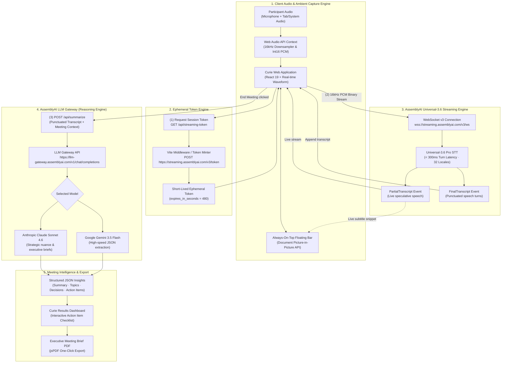

# Curie — Real-Time Meeting Intelligence & AI Summaries

> **"Turn unstructured meeting conversations into instant, actionable intelligence."**  
> Ambient meeting intelligence engine powered by **AssemblyAI Universal-3.6 Pro** streaming STT and **AssemblyAI LLM Gateway** (Anthropic Claude Sonnet 4.6 & Google Gemini Flash). Real-time live transcription, native Document Picture-in-Picture desktop overlay, automatic executive synthesis, key decisions, action items, and instant PDF report export.

[](https://www.assemblyai.com/)
[](https://www.assemblyai.com/docs/streaming/getting-started/transcribe-streaming-audio)
[](https://www.assemblyai.com/docs/llm-gateway/quickstart)
[](https://developer.chrome.com/docs/web-platform/document-picture-in-picture/)
[](https://www.assemblyai.com/docs/streaming/multilingual-transcription)
[](https://www.assemblyai.com/products/streaming-speech-to-text)
[](https://opensource.org/licenses/MIT)

---

## ⚡ Quick Links

- [🌟 What is Curie?](#-what-is-curie)
- [🏗️ Architecture & Pipeline](#️-architecture--pipeline)
  - [End-to-End System Flow](#end-to-end-system-flow)
  - [Pipeline Stages](#pipeline-stages)
- [🚀 Quickstart & Setup](#-quickstart--setup)
- [✨ Key Features](#-key-features)
  - [1. Universal-3.6 Pro Real-Time Streaming](#1-universal-36-pro-real-time-streaming)
  - [2. Always-On-Top Document Picture-in-Picture Overlay](#2-always-on-top-document-picture-in-picture-overlay)
  - [3. Dual Model LLM Gateway (Claude Sonnet 4.6 & Gemini Flash)](#3-dual-model-llm-gateway-claude-sonnet-46--gemini-flash)
  - [4. Zero-Mic Synchronized Demo Mode](#4-zero-mic-synchronized-demo-mode)
  - [5. Executive PDF Report Export](#5-executive-pdf-report-export)
- [🔒 Single-Key Security Architecture](#-single-key-security-architecture)
- [📡 API Reference](#-api-reference)
- [🌐 Supported Languages (32 Locales)](#-supported-languages-32-locales)
- [📚 Interactive Documentation](#-interactive-documentation)
- [🛠️ Tech Stack](#️-tech-stack)
- [📄 License](#-license)

---

## 🌟 What is Curie?

**Curie** is a browser-based ambient meeting companion built for Google Meet, Zoom, Microsoft Teams, and in-person discussions:

1. **Ambient Background Listening**: Keep Curie open in a browser tab. It captures meeting audio via your device microphone and/or shared browser tab at 16,000 Hz PCM and streams it live over WebSocket to AssemblyAI.
2. **Universal-3.6 Pro Streaming**: Real-time word-by-word transcription with sub-second latency and native multilingual code-switching across 32 languages.
3. **Always-On-Top Floating Overlay**: Pop out a compact, native Document Picture-in-Picture window that floats above Zoom or your desktop with live subtitles, waveform audio meter, and meeting controls.
4. **Dual-Model LLM Gateway Synthesis**: The instant you conclude a meeting, AssemblyAI's LLM Gateway routes the transcript through **Claude Sonnet 4.6** or **Gemini Flash** to extract:
   - **Executive Summary**: 2-3 sentence high-level brief.
   - **Key Topics**: Core themes discussed.
   - **Key Points**: Bulleted takeaways from the conversation.
   - **Decisions Made**: Explicit agreements reached by participants.
   - **Action Items**: Next steps, assignees, and deadlines with interactive checkboxes.
   - **Sentiment Analysis**: Overall meeting mood and tone.
5. **Instant PDF Report**: Download a beautifully styled executive meeting brief in one click.
6. **No-Mic Demo Mode**: Test the full end-to-end pipeline instantly using simulated meeting audio and synchronized transcripts without needing an active microphone.

---

## 🏗️ Architecture & Pipeline

### End-to-End System Flow


```mermaid
flowchart TD
    subgraph Client["1. Client Audio & Ambient Capture Engine"]
        UserAudio["Participant Audio<br/>(Microphone + Tab/System Audio)"]
        WebAudio["Web Audio API Context<br/>(16kHz Downsampler & Int16 PCM)"]
        CurieUI["Curie Web Application<br/>(React 19 + Real-time Waveform)"]
        PiPBar["Always-On-Top Floating Bar<br/>(Document Picture-in-Picture API)"]
        
        UserAudio --> WebAudio
        WebAudio --> CurieUI
        CurieUI <--> PiPBar
    end

    subgraph AuthLayer["2. Ephemeral Token Engine"]
        TokenReq["(1) Request Session Token<br/>GET /api/streaming-token"]
        TokenGen["Vite Middleware / Token Minter<br/>POST https://streaming.assemblyai.com/v3/token"]
        TokenResp["Short-Lived Ephemeral Token<br/>(expires_in_seconds = 480)"]
        
        CurieUI --> TokenReq
        TokenReq --> TokenGen
        TokenGen --> TokenResp
        TokenResp --> CurieUI
    end

    subgraph SpeechEngine["3. AssemblyAI Universal-3.6 Streaming Engine"]
        WSS["WebSocket v3 Connection<br/>wss://streaming.assemblyai.com/v3/ws"]
        STTModel["Universal-3.6 Pro STT<br/>(&lt; 300ms Turn Latency · 32 Locales)"]
        PartialEvent["PartialTranscript Event<br/>(Live speculative speech)"]
        FinalEvent["FinalTranscript Event<br/>(Punctuated speech turns)"]
        
        CurieUI -->|" (2) 16kHz PCM Binary Stream "| WSS
        WSS --> STTModel
        STTModel --> PartialEvent
        STTModel --> FinalEvent
        PartialEvent -->|" Live stream "| CurieUI
        FinalEvent -->|" Append transcript "| CurieUI
        PartialEvent -.->|" Live subtitle snippet "| PiPBar
    end

    subgraph LLMGateway["4. AssemblyAI LLM Gateway (Reasoning Engine)"]
        SummarizeReq["(3) POST /api/summarize<br/>(Punctuated Transcript + Meeting Context)"]
        LLMAPI["LLM Gateway API<br/>https://llm-gateway.assemblyai.com/v1/chat/completions"]
        ModelChoice{"Selected Model"}
        ClaudeModel["Anthropic Claude Sonnet 4.6<br/>(Strategic nuance & executive briefs)"]
        GeminiModel["Google Gemini 3.5 Flash<br/>(High-speed JSON extraction)"]
        
        CurieUI -->|" End Meeting clicked "| SummarizeReq
        SummarizeReq --> LLMAPI
        LLMAPI --> ModelChoice
        ModelChoice --> ClaudeModel
        ModelChoice --> GeminiModel
    end

    subgraph Insights["5. Meeting Intelligence & Export"]
        JSONOutput["Structured JSON Insights<br/>(Summary · Topics · Decisions · Action Items)"]
        ResultsDashboard["Curie Results Dashboard<br/>(Interactive Action Item Checklist)"]
        PDFExport["Executive Meeting Brief PDF<br/>(jsPDF One-Click Export)"]
        
        ClaudeModel --> JSONOutput
        GeminiModel --> JSONOutput
        JSONOutput --> ResultsDashboard
        ResultsDashboard --> PDFExport
    end
```

### Pipeline Stages

1. **Audio Normalization**: The browser Web Audio API reads incoming 44.1kHz or 48kHz audio streams, merges tab audio with microphone input if selected, downsamples to 16,000 Hz, and converts float32 samples to 16-bit Little-Endian signed integers (`Int16Array`).
2. **WebSocket Streaming**: Binary PCM frames are transmitted in real time over a secure WebSocket connection to `wss://streaming.assemblyai.com/v3/ws`. Universal-3.6 Pro returns partial speech hypotheses (sub-300ms) and final punctuated sentences.
3. **PiP Synchronization**: The Document Picture-in-Picture window receives live state updates (transcripts, timer, mic mute) through React state and DOM event dispatching without losing connection when switching desktops or full-screen apps.
4. **LLM Synthesis**: Upon session conclusion, the full punctuated transcript is sent to `/api/summarize`, which calls AssemblyAI's unified LLM Gateway.
5. **Executive Delivery**: Client parses structured JSON and renders interactive checklist cards and an instant downloadable PDF.

---

## 🚀 Quickstart & Setup

### Prerequisites
- Node.js 18+ (tested on Node 20 and Node 22)
- npm or pnpm
- AssemblyAI API Key ([Get one free at assemblyai.com](https://www.assemblyai.com/dashboard/home))

### 1. Clone & Install
```bash
git clone https://github.com/farhan0-code/curie.git
cd curie
npm install
```

### 2. Configure Environment
Create a `.env` file in the project root:
```env
ASSEMBLYAI_API_KEY=your_assemblyai_api_key_here
```

*(Note: The API key is kept secure server-side in Vite middleware and is never bundled into client JavaScript).*

### 3. Launch Development Server
```bash
npm run dev
```
Open [http://localhost:3000](http://localhost:3000) in Google Chrome, Brave, or Microsoft Edge.

### 4. Build for Production
```bash
npm run build
npm run preview
```

---

## ✨ Key Features

### 1. Universal-3.6 Pro Real-Time Streaming
- Sub-second speech recognition with word-by-word streaming updates.
- Native code-switching across 32 supported languages without restarting sessions.
- Automatic punctuation, capitalization, and speaker turn delineation.

### 2. Always-On-Top Document Picture-in-Picture Overlay
- Leverages the modern Web Platform **Document Picture-in-Picture API**.
- Floats over Zoom, Microsoft Teams, Google Meet, or your code editor.
- Displays live subtitle feed, active duration counter, audio waveform meter, microphone mute button, and 1-click meeting wrap-up.

### 3. Dual Model LLM Gateway (Claude Sonnet 4.6 & Gemini Flash)
- **Anthropic Claude Sonnet 4.6**: Deep reasoning for complex strategic discussions, nuanced context, and rigorous decision extraction.
- **Google Gemini 3.5 Flash**: Sub-second turnaround for fast standups, daily syncs, and rapid notes.
- Powered completely through AssemblyAI's LLM Gateway using a **single AssemblyAI API key**.

### 4. Zero-Mic Synchronized Demo Mode
- Allows anyone to test the full end-to-end pipeline without microphone permissions.
- Plays realistic multi-speaker product meeting dialogue with audio synthesis.
- Emulates live streaming packets and renders real-time waveform visualizers.

### 5. Executive PDF Report Export
- 1-click client-side export using `jsPDF`.
- Generates a publication-grade meeting summary report with executive brief, topics, decisions, and action items.

---

## 🔒 Single-Key Security Architecture

Curie requires **only one API key** (`ASSEMBLYAI_API_KEY`):

- **Temporary Authentication Tokens**: The frontend never exposes your permanent API key. The server endpoint `GET /api/streaming-token` issues a short-lived, single-use token (`expires_in_seconds=480`) to initialize the browser's WebSocket connection.
- **Unified LLM Gateway**: The post-meeting summary runs through AssemblyAI's LLM Gateway using the same AssemblyAI API key. **No external Anthropic or Google Gemini keys are needed.**
- **Zero-Retention Privacy**: Audio streams in real-time and is not persistently stored on any server after the session concludes. Meeting transcripts live only in memory in your browser session.

---

## 📡 API Reference

### 1. Ephemeral Streaming Token
Generates a short-lived token to initialize browser WebSocket connections.

- **Endpoint**: `GET /api/streaming-token`
- **Headers**: None (Internal proxy uses `ASSEMBLYAI_API_KEY`)
- **Response**:
```json
{
  "token": "eyJhbGciOiJIUzI1NiIsInR5cCI6IkpXVCJ9..."
}
```

### 2. Meeting Summarization & Extraction
Routes meeting transcripts through AssemblyAI's LLM Gateway for structured JSON synthesis.

- **Endpoint**: `POST /api/summarize`
- **Request Body**:
```json
{
  "transcript": "Full text of the meeting conversation...",
  "meetingName": "Q4 Roadmap Sync",
  "language": "en",
  "analysisModel": "claude-sonnet-4-6"
}
```
*(Options for `analysisModel`: `"claude-sonnet-4-6"` | `"gemini-3.5-flash"`)*

- **Response**:
```json
{
  "summary": "2-3 sentence executive summary of the meeting",
  "keyTopics": ["Topic 1", "Topic 2", "Topic 3"],
  "keyPoints": ["Key takeaway point 1", "Key takeaway point 2"],
  "decisions": ["Agreed to ship beta on Friday", "Budget approved"],
  "actionItems": ["Alex: Finalize API endpoints", "Sarah: Conduct user testing"],
  "sentiment": "Productive and focused",
  "modelUsed": "Claude Sonnet 4.6 via AssemblyAI LLM Gateway"
}
```

---

## 🌐 Supported Languages (32 Locales)

Curie supports 32 languages with automatic code-switching powered by AssemblyAI Universal-3.6 Pro:

| Code | Language | Code | Language | Code | Language | Code | Language |
|------|----------|------|----------|------|----------|------|----------|
| `en` | English | `es` | Spanish | `fr` | French | `de` | German |
| `it` | Italian | `pt` | Portuguese | `hi` | Hindi | `ja` | Japanese |
| `ko` | Korean | `zh` | Chinese | `nl` | Dutch | `pl` | Polish |
| `ru` | Russian | `tr` | Turkish | `uk` | Ukrainian | `vi` | Vietnamese |
| `ar` | Arabic | `sv` | Swedish | `no` | Norwegian | `fi` | Finnish |
| `da` | Danish | `el` | Greek | `cs` | Czech | `ro` | Romanian |
| `hu` | Hungarian | `id` | Indonesian | `ms` | Malay | `th` | Thai |
| `he` | Hebrew | `bn` | Bengali | `ta` | Tamil | `te` | Telugu |

---

## 📚 Interactive Documentation

Curie includes a comprehensive, interactive documentation hub built right into the web app:

- Open **Docs** in the navigation bar or visit [http://localhost:3000/#docs](http://localhost:3000/#docs).
- Features searchable sections, architecture breakdowns, code snippets with 1-click copy, Picture-in-Picture guides, and API documentation.

---

## 🛠️ Tech Stack

- **Frontend**: React 19, Tailwind CSS, Lucide Icons, Framer Motion
- **Voice Intelligence**: AssemblyAI Streaming STT v3 (`universal-3-6-pro`)
- **Reasoning & Summarization**: AssemblyAI LLM Gateway (`claude-sonnet-4-6`, `gemini-3.5-flash`)
- **Desktop Overlay**: Document Picture-in-Picture API
- **Audio Ingestion**: Web Audio API (16kHz PCM Little-Endian signed integers)
- **PDF Generation**: jsPDF
- **Tooling**: Vite 6, PostCSS, Autoprefixer

---

## 📄 License

MIT License — Copyright (c) 2026 Curie Contributors.
