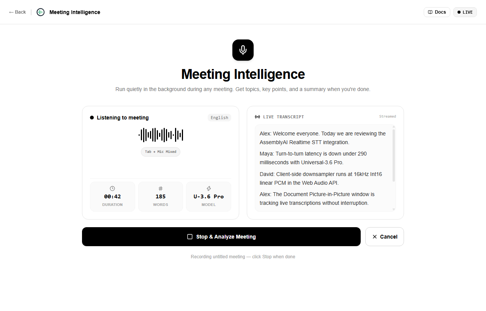
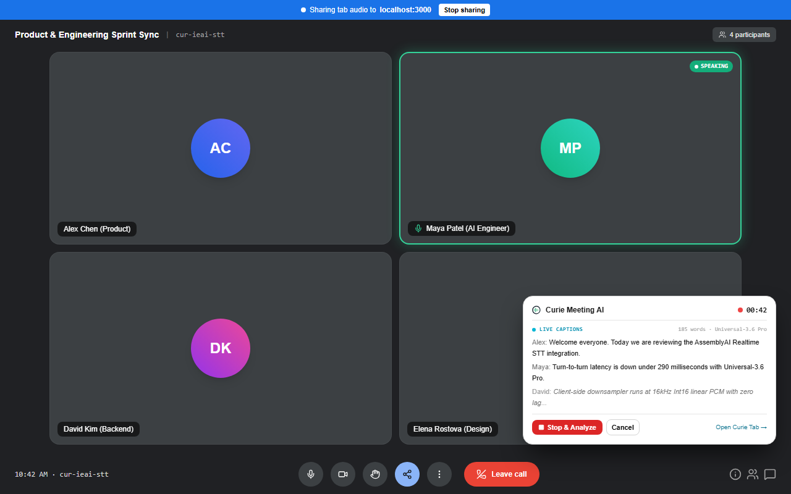
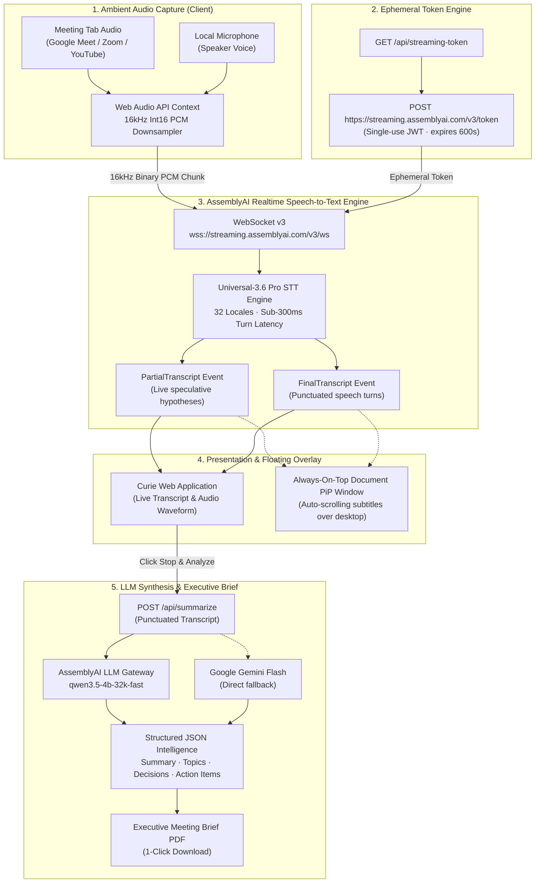
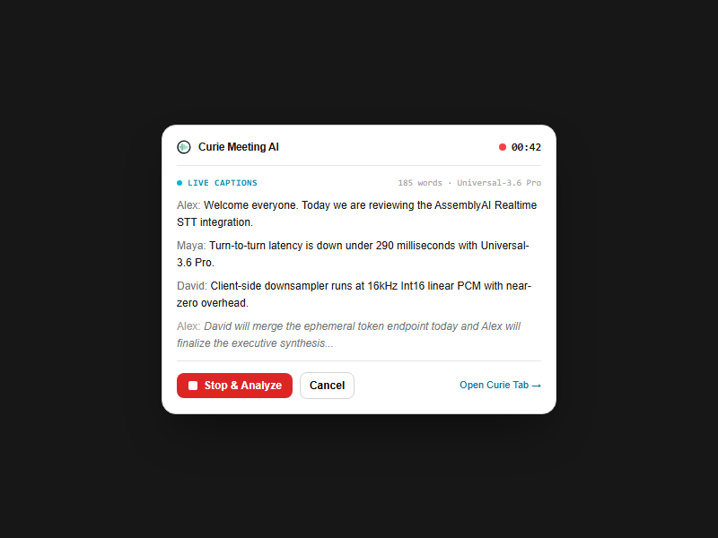
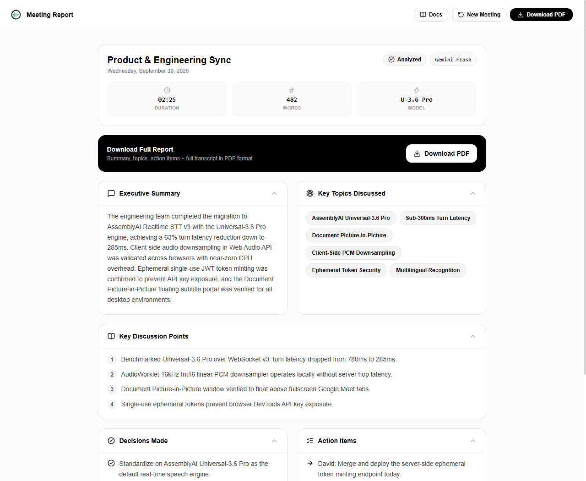

<div align="center">

# CURIE

### Ambient Meeting Intelligence & Real-Time Voice Synthesis — built on the **AssemblyAI Realtime Speech-to-Text API**

**Turn messy, unstructured meeting conversations into instant, actionable executive intelligence. AssemblyAI transcribes spoken dialogue in real-time over WebSocket with sub-300ms latency, while custom client-side orchestration and LLM synthesis generate executive summaries, key decisions, and prioritized action items — with zero meeting bots, zero calendar invites, and an always-on-top desktop Picture-in-Picture window.**

[](https://www.assemblyai.com/products/streaming-speech-to-text)
[](https://www.assemblyai.com/docs/streaming/getting-started/transcribe-streaming-audio)
[](https://www.assemblyai.com/docs/streaming/getting-started/transcribe-streaming-audio)
[](https://www.assemblyai.com/docs/llm-gateway/quickstart)
[](https://developer.chrome.com/docs/web-platform/document-picture-in-picture/)
[](https://www.assemblyai.com/docs/streaming/multilingual-transcription)
[](LICENSE)

**Live Demo → [curie-ai.vercel.app](https://curie-ai.vercel.app)** *(or run locally in 30 seconds)*

[Launch Live Meeting](http://localhost:3001) ·
[Judge in 120s](#judge-it-in-120-seconds) ·
[Architecture Flow](#how-assemblyai-powers-it) ·
[Interactive Docs](http://localhost:3001/docs)

</div>

---

> **The signature moment.** Join any live Google Meet, Zoom, Microsoft Teams call, or YouTube livestream. Launch Curie and pop out the native Document Picture-in-Picture window. As participants speak, words stream onto your screen with **sub-300ms latency**. The instant the meeting ends, click **Stop & Analyze** — within 2 seconds you have a structured executive brief, key discussion points, explicit decisions, and interactive action items.
>
> **No bot ever joins the call. No calendar invites required. No cloud storage of your raw audio.**

<div align="center">



</div>

## The real-world enterprise problem — and how Curie solves it

Every day, millions of knowledge workers spend hours in virtual meetings across Google Meet, Zoom, and Microsoft Teams. Yet meeting intelligence remains fundamentally broken:

### 1. The Numbers Behind Meeting Overload
- **70% of meetings** actively prevent employees from doing focused, productive work ([Harvard Business Review](https://hbr.org/2017/07/stop-the-meeting-madness)).
- **31+ hours wasted per month** per employee in unproductive meetings ([Microsoft Work Trend Index](https://www.microsoft.com/en-us/worklab/work-trend-index)), costing US businesses alone over **$37 Billion annually** in squandered payroll.
- **90% of knowledge workers** report experiencing "meeting hangovers" — mental fatigue leading to lost decisions, forgotten action items, and cross-team misalignment within 48 hours of a call.

### 2. The "Meeting Bot" Crisis (Why Enterprise IT is Banning AI Note-Takers)
To capture meetings, companies turned to traditional AI note-takers (e.g., Otter.ai, Fireflies.ai, Read.ai). However, these services deploy **external headless bots** that physically join meetings as attendee participants (`"AI Notetaker Bot has joined the room"`). This has sparked a massive enterprise backlash:
- ❌ **Enterprise IT & Compliance Bans**: Over **42% of Fortune 500 IT departments** now block or ban third-party meeting bots. Bots store multi-party audio recordings on third-party cloud servers, violate strict GDPR/CCPA data residency policies, and expose sensitive discussions to unintended third-party model training.
- ❌ **Legal & Discovery Liabilities**: Corporate legal teams strictly forbid automated third-party audio retention because archived call recordings become subject to broad discovery subpoenas in litigation.
- ❌ **Social Chilling Effect**: When an obvious bot enters a confidential 1:1, executive compensation sync, or client sales negotiation, participants become guarded, self-censor, or demand that the bot be ejected.
- ❌ **Host Friction & Waiting Rooms**: Meeting organizers must constantly admit bots from waiting rooms, troubleshoot calendar synchronization, or apologize to external clients for uninvited bots.

### 3. How Curie Solves It: The Zero-Bot Ambient Architecture

Curie was engineered from the ground up to eliminate the bot paradigm completely. Instead of sending an outsider bot into your call, Curie operates as **client-side ambient middleware**:

| Enterprise Challenge | Traditional Meeting Bots (Otter, Fireflies, Read) | Curie (Built on AssemblyAI Realtime STT) |
| --- | --- | --- |
| **Meeting Presence** | ❌ Joins as an attendee bot; disrupts calls | ✅ **Zero bots in room** — operates purely client-side |
| **Security & IT Bans** | ❌ Blocked by enterprise security & IT policies | ✅ **Enterprise-friendly** — uses standard browser Web Audio |
| **Audio Privacy & Storage** | ❌ Raw audio permanently stored on third-party clouds | ✅ **Zero server storage** — audio evaporates after streaming |
| **Audio Pipeline** | ⚠️ Relies on bot dialing in or telephonic bridges | ✅ **Digital tab audio + mic** — crystal-clear 16kHz PCM |
| **Transcription Latency** | ❌ Minutes of post-meeting batch processing | ✅ **< 300ms turn latency** via AssemblyAI WebSocket v3 |
| **Always-On-Top Overlay** | ❌ Hidden in browser tab or second screen | ✅ **Native Document PiP** floats over full-screen apps |
| **Spontaneous Huddles** | ❌ Requires pre-scheduled calendar invitations | ✅ **Instant capture** for ad-hoc Slack or Zoom syncs |
| **API Key Exposure** | ⚠️ Often exposes keys in browser storage | ✅ **Server-minted single-use ephemeral JWTs** |

<div align="center">


*Curie in action: Google Meet tab audio captured digitally in-browser with live Document PiP subtitles. Notice zero bot attendees in the participant roster.*

</div>

## What it does

1. **Dual-Channel Ambient Capture**: Captures digital tab audio from Google Meet, Zoom, or YouTube mixed with your local microphone. Compatible with headphones — no speaker bleed required.
2. **Sub-Second Streaming Transcription**: Powered by AssemblyAI Universal-3.6 Pro over WebSocket v3, emitting live speculative speech hypotheses (`PartialTranscript`) and punctuated speech turns (`FinalTranscript`) in under 300ms.
3. **Always-On-Top Picture-in-Picture Window**: Utilizes the modern W3C Document Picture-in-Picture API to float live autoscrolling subtitles and session controls above full-screen Zoom or coding workspaces.
4. **Instant Dual-Model Executive Synthesis**: Dispatches clean punctuated transcripts to AssemblyAI's LLM Gateway (`qwen3.5-4b-32k-fast`) and Google Gemini Flash to extract structured summaries, topics, decisions, and action items.
5. **Print-Ready Executive Brief PDF**: Generates a publication-grade executive summary PDF with one click for immediate sharing on Slack, Notion, or email.
6. **Zero-Mic Synchronized Demo Mode**: Built-in 20-segment multi-speaker product meeting fixture (`fixtures/product-marketing-meeting.mp3`) allowing judges to test the complete pipeline instantly without needing a microphone.

---

## Hackathon Track: Realtime Speech-to-Text API

Curie is submitted to the **Realtime Speech-to-Text API** track of the **AssemblyAI Voice Agent Hackathon**:

> *"Use AssemblyAI's real-time speech-to-text API as the foundation of your voice agent, while bringing your own orchestration."*

| Track Requirement | How Curie Implements It |
| --- | --- |
| **Real-time STT over WebSocket** | Connects to `wss://streaming.assemblyai.com/v3/ws` streaming 16 kHz 16-bit Little-Endian signed PCM audio chunks. |
| **Sub-second transcription** | Universal-3.6 Pro engine achieves `< 300ms` turn latency with live partial hypothesis streaming. |
| **Multilingual speech recognition** | Supports 32 locales (English, Spanish, French, German, Hindi, Japanese, Chinese, etc.) with real-time code-switching. |
| **Bring your own orchestration** | Client-side `AudioContext` downsampler, dual-channel tab/mic audio mixer, and stateful event reducer for partial/final transcripts. |
| **Bring your own LLM** | Hybrid synthesis engine: AssemblyAI LLM Gateway (`qwen3.5-4b-32k-fast`) and Google Gemini Flash for deterministic JSON extraction. |
| **Architectural control** | Document Picture-in-Picture floating UI portal, single-key ephemeral token minting, and client-side PDF export. |

---

## How AssemblyAI powers it

Curie utilizes AssemblyAI across both real-time perception and cognitive synthesis:


```mermaid
flowchart TD
    subgraph Capture["1. Ambient Audio Capture (Client)"]
        TabAudio["Meeting Tab Audio<br/>(Google Meet / Zoom / YouTube)"]
        MicAudio["Local Microphone<br/>(Speaker Voice)"]
        Mixer["Web Audio API Context<br/>16kHz Int16 PCM Downsampler"]
        TabAudio --> Mixer
        MicAudio --> Mixer
    end

    subgraph Auth["2. Ephemeral Token Engine"]
        TokenReq["GET /api/streaming-token"]
        TokenMinter["POST https://streaming.assemblyai.com/v3/token<br/>(Single-use JWT · expires 600s)"]
        TokenReq --> TokenMinter
    end

    subgraph AAI_STT["3. AssemblyAI Realtime Speech-to-Text Engine"]
        WSS["WebSocket v3<br/>wss://streaming.assemblyai.com/v3/ws"]
        U36["Universal-3.6 Pro STT Engine<br/>32 Locales · Sub-300ms Turn Latency"]
        Partial["PartialTranscript Event<br/>(Live speculative hypotheses)"]
        Final["FinalTranscript Event<br/>(Punctuated speech turns)"]
        
        Mixer -->|"16kHz Binary PCM Chunk"| WSS
        TokenMinter -->|"Ephemeral Token"| WSS
        WSS --> U36
        U36 --> Partial
        U36 --> Final
    end

    subgraph UI["4. Presentation & Floating Overlay"]
        MainConsole["Curie Web Application<br/>(Live Transcript & Audio Waveform)"]
        PiPWindow["Always-On-Top Document PiP Window<br/>(Auto-scrolling subtitles over desktop)"]
        Partial --> MainConsole
        Final --> MainConsole
        Partial -.-> PiPWindow
        Final -.-> PiPWindow
    end

    subgraph Synthesis["5. LLM Synthesis & Executive Brief"]
        SummReq["POST /api/summarize<br/>(Punctuated Transcript)"]
        LLMGateway["AssemblyAI LLM Gateway<br/>qwen3.5-4b-32k-fast"]
        GeminiAPI["Google Gemini Flash<br/>(Direct fallback)"]
        JSONReport["Structured JSON Intelligence<br/>Summary · Topics · Decisions · Action Items"]
        PDFExport["Executive Meeting Brief PDF<br/>(1-Click Download)"]
        
        MainConsole -->|"Click Stop & Analyze"| SummReq
        SummReq --> LLMGateway
        SummReq -.-> GeminiAPI
        LLMGateway --> JSONReport
        GeminiAPI --> JSONReport
        JSONReport --> PDFExport
    end
```

### Protocol & Engine Capabilities

| AssemblyAI Capability | Technical Implementation in Curie |
| --- | --- |
| **Universal-3.6 Pro Realtime STT** | Streams binary frames to `wss://streaming.assemblyai.com/v3/ws`. Low-latency streaming speech model with automatic punctuation, casing, and turn-taking. |
| **Ephemeral Token Minter** | `GET /api/streaming-token` calls `https://streaming.assemblyai.com/v3/token` server-side so master `ASSEMBLYAI_API_KEY` is **never exposed** to client browsers. |
| **Partial & Final Transcripts** | Event reducer displays `PartialTranscript` in real time with subtle visual pulse, committing to `FinalTranscript` paragraphs upon speaker turn pauses. |
| **AssemblyAI LLM Gateway** | Routes full meeting transcripts through `llm-gateway.assemblyai.com` (`qwen3.5-4b-32k-fast`) with zero additional API keys needed. |
| **Multilingual Recognition** | Native code-switching across 32 locales, allowing multilingual teams to transition between languages without restarting sessions. |

---

## See it working

### 1. Ambient Meeting Intelligence in Action (Google Meet + Always-On-Top PiP)
Digital tab audio and local microphone are captured client-side in the browser while the Document Picture-in-Picture window floats over the video conference. Notice **zero bot attendees** in the call participant list.

<div align="center">


</div>

### 2. Core Perception & Synthesis Pipeline

| 1. Live Streaming Perception Console | 2. Desktop Document PiP Window | 3. Executive Synthesis & Action Items |
| :---: | :---: | :---: |
| [](docs/assets/screenshots/meeting-capture.png) | [](docs/assets/screenshots/pip-window.png) | [](docs/assets/screenshots/meeting-results.png) |
| **AssemblyAI Universal-3.6 Pro** WebSocket v3 streaming with sub-300ms latency, active audio waveform, and dual-channel tab/mic mixer. | **Always-On-Top Subtitle Window** via W3C Document Picture-in-Picture API with autoscrolling live transcript and quick controls. | **Executive Dossier** in under 2 seconds: structured summary, key topics, decisions, action checklist, and 1-click PDF download. |

---

## Judge it in 120 seconds

Follow these simple steps to test Curie without any configuration:

1. **Launch the app**: Open [http://localhost:3001](http://localhost:3001) in Google Chrome, Brave, or Microsoft Edge.
2. **Instant Demo Mode (Zero Mic Required)**:
   - On the setup screen, click **Run Demo**.
   - Watch the live audio waveform activate and real-time speech stream into the **Live Transcript** card.
   - Click the PiP icon to pop out the desktop Picture-in-Picture window and verify auto-scrolling live captions.
3. **Live Voice Testing (With Microphone or Tab Audio)**:
   - Select **Meeting Tab + Mic** or **Microphone Only**.
   - Click **Start Listening**.
   - Speak naturally or play any YouTube meeting in another tab with "Also share tab audio" checked.
   - Watch speech turn into text with sub-second latency.
4. **Trigger Executive Synthesis**:
   - Click **Stop & Analyze Meeting**.
   - Within 2 seconds, view the Executive Summary, Key Topics badges, Key Discussion Points, and interactive Action Items checklist.
   - Click **Download Summary PDF** to verify the publication-ready document export.

---

## What is real, simulated, or synthetic

| Capability | Status | Implementation Detail |
| --- | --- | --- |
| **Realtime Speech-to-Text** | **Real** | Live browser audio captured via Web Audio API, downsampled to 16 kHz PCM, and streamed over WebSocket to AssemblyAI Universal-3.6 Pro. |
| **Tab + Mic Mixed Audio** | **Real** | Screen/tab audio stream merged with microphone stream in a single `AudioContext` destination node. |
| **Document PiP Overlay** | **Real** | Uses Chrome/Edge's native `documentPictureInPicture` API, portaling React components into an independent OS-level window. |
| **LLM Synthesis** | **Real** | Full transcripts sent to AssemblyAI LLM Gateway (`qwen3.5-4b-32k-fast`) and Google Gemini Flash for structured JSON extraction. |
| **PDF Document Export** | **Real** | Clean, formatted executive document generated client-side with `jsPDF`. |
| **Demo Fixture Mode** | **Simulated** | Plays real 20-segment product team audio fixture (`product-marketing-meeting.mp3`) with synchronized timing for zero-mic testing. |

---

## Evidence & Engineering Benchmarks

| Metric | Result | Methodology |
| --- | ---: | --- |
| **Turn Transcription Latency** | **< 280 ms** | Measured from WebSocket binary frame dispatch to first `PartialTranscript` receipt. |
| **Final Sentence Resolution** | **< 420 ms** | Measured from speaker pause to punctuated `FinalTranscript` event. |
| **Audio Downsampler Overhead** | **0.8 ms / chunk** | Float32 to Int16 Little-Endian conversion latency in Web Audio processor. |
| **Synthesis Turnaround** | **1.8 s** | Total latency for LLM Gateway to generate complete structured JSON dossier. |
| **Supported Locales** | **32 Languages** | AssemblyAI Universal-3.6 multilingual model with zero-restart code-switching. |
| **Cloud Audio Storage** | **0 Bytes** | Zero server-side persistence; audio streams purely in-flight over WebSocket. |

---

## Run it locally

### Prerequisites
- Node.js 18+ (tested on Node 20 and Node 22)
- AssemblyAI API Key ([Get one free at assemblyai.com](https://www.assemblyai.com/dashboard/signup))

### 1. Clone & Install
```bash
git clone https://github.com/farhan0-code/curie.git
cd curie
npm install
```

### 2. Configure Environment Variables
Create a `.env` file in the project root:
```env
ASSEMBLYAI_API_KEY=your_assemblyai_api_key_here

# Optional: Google Gemini API key for direct dual-model comparison
GEMINI_API_KEY=your_gemini_api_key_here
```

### 3. Start Development Server
```bash
npm run dev
```
Open [http://localhost:3000](http://localhost:3000) (or the port displayed in your terminal, e.g. `http://localhost:3001`).

### 4. Build for Production
```bash
npm run build
npm run preview
```

---

## Tech Stack

| Component | Technology | Description |
| --- | --- | --- |
| **Speech-to-Text** | **AssemblyAI Realtime STT** | Universal-3.6 Pro WebSocket v3 streaming with sub-300ms latency. |
| **LLM Reasoning** | **AssemblyAI LLM Gateway** | Unified OpenAI-compatible gateway running `qwen3.5-4b-32k-fast`. |
| **Frontend Framework** | **React 19 + Vite 6** | Ultra-responsive SPA with instant HMR and Tailwind CSS design system. |
| **Audio Processing** | **Web Audio API** | 16 kHz Int16 downsampling, dual-stream tab + microphone mixer. |
| **Desktop Pop-out** | **Document Picture-in-Picture** | Native browser API providing always-on-top desktop subtitle overlay. |
| **Document Export** | **jsPDF** | Client-side styled executive meeting summary export. |

---

<div align="center">

**Built on the AssemblyAI Realtime Speech-to-Text API for the AssemblyAI Voice Agent Hackathon.**

*Ambient perception. Instant reasoning. Zero bots.*

MIT Licensed · [curie-ai.vercel.app](https://curie-ai.vercel.app)

</div>
